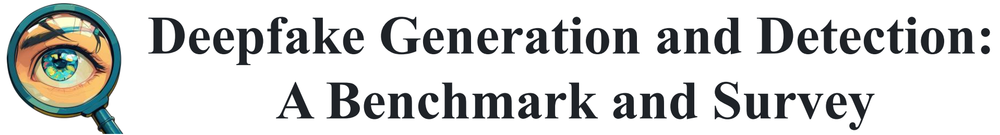
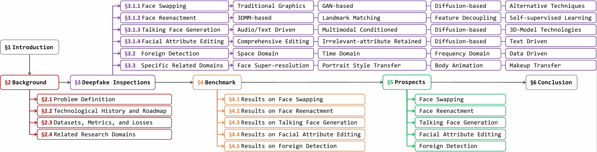
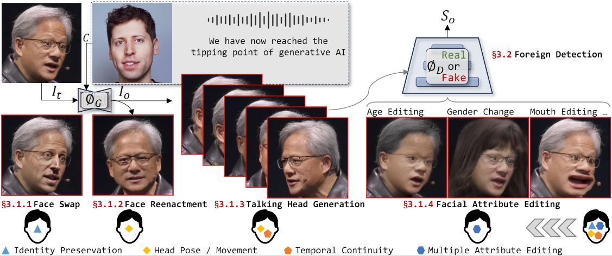

     
   

    <a href="https://scholar.google.com.hk/citations?user=1yhGS5sAAAAJ&hl=zh-CN"><strong>Gan Pei 1*</strong></a>
    .
    <a href="https://zhangzjn.github.io/"><strong>Jiangning Zhang 2*</strong></a>
    .
    <a href="https://scholar.google.com.hk/citations?user=8-Vo9cUAAAAJ&hl=zh-CN"><strong>Menghan Hu1#</strong></a>
    .
    <a href="https://scholar.google.com.hk/citations?hl=zh-CN&user=4daxK2AAAAAJ"><strong>Zhenyu Zhang3</strong></a>
    .
    <a href="https://scholar.google.com.hk/citations?hl=zh-CN&user=fqte5H4AAAAJ"><strong>Chengjie Wang4</strong></a>
    .
    <a href="https://github.com/flyingby/Awesome-Deepfake-Generation-and-Detection"><strong>Yunsheng Wu4</strong></a>.
    

    <a href="https://scholar.google.com.hk/citations?user=E6zbSYgAAAAJ&hl=zh-CN"><strong>Guangtao Zhai5</strong></a>
    .
    <a href="https://scholar.google.com.hk/citations?hl=zh-CN&user=6CIDtZQAAAAJ"><strong>Jian Yang3</strong></a>
    .
    <a href="https://scholar.google.com.hk/citations?user=RwlJNLcAAAAJ&hl=zh-CN&oi=ao"><strong>Dacheng Tao6</strong></a>

    <strong>1East China Normal University</strong> &nbsp;&nbsp;&nbsp; <strong>2Zhejiang University</strong> &nbsp;&nbsp;&nbsp; <strong>3Nanjing University</strong> &nbsp;&nbsp;&nbsp; <strong>4Tencent Youtu Lab</strong>
     
    <strong>5Shanghai Jiao Tong University</strong>  &nbsp;&nbsp;&nbsp; <strong>6Nanyang Technological University</strong>

 <strong>ACM Computing Surveys 2026</strong>
      </a>

    
  

# We research Deepfake Generation and Detection

This work focuses on the aspect of facial manipulation in Deepfake, encompassing **Face Swapping**, **Face Reenactment**,  **Talking Face Generation**, **Face Attribute Editing** and **Forgery Detection**. We believe this will be the most comprehensive survey to date on facial manipulation and detection technologies. Please stay tuned!😉😉😉

### ✨You are welcome to provide us your work with a topic related to deepfake generation or detection!!!

If you discover any missing work or have any suggestions, please feel free to submit a [pull request](https://github.com/flyingby/Awesome-Deepfake-Generation-and-Detection/issues) or [contact us](#contact). We will promptly add the missing papers to this repository.

###  ✨Highlight!!!

[1]  A comprehensive survey for visual Deepfake, including Deepfake generation/detection.

[2]  It also contains several related domains, including Heas Swapping, Face Super-resolution, Face Reconstruction, Face Inpainting, Body Animation, Portrait Style Transfer, Makeup Transfer and Adversarial Sample Detection. 

[3]  We list detailed results for the most representative works.

### ✨Survey pipeline

## Introduction

This work presents a detailed survey on generation and detection tasks about face-related generation, including **Face Swapping**, **Face Reenactment**, **Talking Face Generation**, and **Face Attribute Editing**. In addition, we also introduce several related fields such as Head Swap, Face Super-resolution, Face Reconstruction, Face Inpainting, etc., and select some of them to expand.

## Summary of Contents
- [Introduction](#introduction)
- [Summary of Contents](#summary-of-contents)
- [Methods: A Survey](#methods-a-survey)
  - [Face Swapping](#Face-Swapping)
  - [Face Reenactment](#Face-Reenactment)
  - [Talking Face Generation](#Talking-Face-Generation)
  - [Facial Attribute Editing](#Facial-Attribute-Editing)
  - [Forgery Detection](#Forgery-Detection) 
- [Benchmarks and Datasets](#benchmarks-and-datasets)
- [Related Research Domains](#Related-Research-Domains)
  - [Face Super-resolution](#Face-Super-resolution) 
  - [Portrait Style Transfer](#Portrait-Style-Transfer)
  - [Body Animation](#Body-Animation)
  - [Makeup Transfer](#Makeup-Transfer)
- [Cite The Survey](#Cite-The-Survey)
- [Contact](#contact)

## Methods: A Survey

### Face Swapping
|Year|Venue|Category|Paper Title|Code|
|:-:|:-:|:-:|-|-|
|2025|arXiv|Difussion|[DreamID: High-Fidelity and Fast diffusion-based Face Swapping via Triplet ID Group Learning](https://arxiv.org/abs/2504.14509)|[Code](https://superhero-7.github.io/DreamID/)|
|2025|arXiv|Difussion|[High-Fidelity Diffusion Face Swapping with ID-Constrained Facial Conditioning](https://arxiv.org/abs/2503.22179)|-|
|2025|KBS|GANs|[FDC-Swap: An efficient face swapping framework based on feature disentangling consistency](https://www.sciencedirect.com/science/article/pii/S0950705125005040)|[Code](https://github.com/tzjoyzx/FDC_Swap)|
|2025|ICCV|Difussion|[DynamicFace: High-Quality and Consistent Video Face Swapping using Composable 3D Facial Priors](https://arxiv.org/abs/2501.08553)|[Code](https://dynamic-face.github.io/)|
|2025|CVM|GANs|[LDSwap: A Semantic-Related Latent Code Disentangling Method in StyleSpace Towards High-Resolution Face Swapping]([https://arxiv.org/abs/2501.08553](https://ieeexplore.ieee.org/abstract/document/11005713))|-|
|2025|PR|Difussion|[DiffFace: Diffusion-based Face Swapping with Facial Guidance](https://www.sciencedirect.com/science/article/pii/S0031320325001116)|[Code](https://hxngiee.github.io/DiffFace/)|
|2025|CVPR|Difussion|[Hallo3: Highly Dynamic and Realistic Portrait Image Animation with Video Diffusion Transformer](https://openaccess.thecvf.com/content/CVPR2025/html/Cui_Hallo3_Highly_Dynamic_and_Realistic_Portrait_Image_Animation_with_Video_CVPR_2025_paper.html)|[Code](https://fudan-generative-vision.github.io/hallo3/)|
|2025|CVPR|Difussion|[Zero-Shot Head Swapping in Real-World Scenarios](https://openaccess.thecvf.com/content/CVPR2025/html/Kang_Zero-Shot_Head_Swapping_in_Real-World_Scenarios_CVPR_2025_paper.html)|-|
|2025|ESWA|Difussion|[Ueco: Unified editing chain for efficient appearance transfer with multimodality-guided diffusion](http://sciencedirect.com/science/article/pii/S0957417425001320)|-|
|2025|WACV|Difussion|[Realistic and Efficient Face Swapping: A Unified Approach with Diffusion Models](https://arxiv.org/abs/2409.07269)|[Code](https://github.com/Sanoojan/REFace)|
|2025|WACV|GANs|[PixSwap: High-Resolution Face Swapping for Effective Reflection of Identity via Pixel-Level Supervision with Synthetic Paired Dataset](https://ieeexplore.ieee.org/abstract/document/10943978/?casa_token=vT29-EVcvGYAAAAA:UVwUWtU-7ppAOxsAldksiVW6ZCq-1vE-XKCoAVeBKgLQFbL01KWQ_M_WHDXGynIRA8eUrQRvmw)|-|
|2024|arXiv|Diffusion|[HiFiVFS: High Fidelity Video Face Swapping](https://arxiv.org/abs/2411.18293)|-|
|2024|arXiv|GANs|[Active Fake: DeepFake Camouflage](https://arxiv.org/abs/2409.03200)|-|
|2024|arXiv|Other|[Rank-based No-reference Quality Assessment for Face Swapping](https://arxiv.org/abs/2406.01884)|-|
|2024|arXiv|3DGS|[ImplicitDeepfake: Plausible Face-Swapping through Implicit Deepfake Generation using NeRF and Gaussian Splatting](https://arxiv.org/abs/2402.06390)|[Code](https://github.com/quereste/implicit-deepfake)|
|2024|arXiv|GANs|[LatentSwap: An Efficient Latent Code Mapping Framework for Face Swapping](https://arxiv.org/abs/2402.18351)|[Code](https://github.com/usingcolor/LatentSwap)|
|2024|arXiv|Difussion|[Face Swap via Diffusion Model](https://arxiv.org/abs/2403.01108)|[Code](https://github.com/somuchtome/faceswap)|
|2024|arXiv|GANs|[E4S: Fine-grained Face Swapping via Editing With Regional GAN Inversion](https://arxiv.org/abs/2310.15081)|[Code](https://e4s2024.github.io/)|
|2024|NeurIPS|Diffusion|[FuseAnyPart: Diffusion-Driven Facial Parts Swapping via Multiple Reference Images](https://arxiv.org/abs/2410.22771)|[Code](https://github.com/Thomas-wyh/FuseAnyPart)|
|2024|NeurIPS|Diffusion|[FuseAnyPart: Diffusion-Driven Facial Parts Swapping via Multiple Reference Images](https://proceedings.neurips.cc/paper_files/paper/2024/hash/939f20cc178460749e4ab5fa28fd3b10-Abstract-Conference.html)|[Code](https://github.com/Thomas-wyh/FuseAnyPart)|
|2024|ECCV|VAEs|[SelfSwapper: Self-Supervised Face Swapping via Shape Agnostic Masked AutoEncoder](https://link.springer.com/content/pdf/10.1007/978-3-031-73001-6_22.pdf)|-|
|2024|ACM MM|VAEs|[CodeSwap: Symmetrically Face Swapping Based on Prior Codebook](https://openreview.net/forum?id=TYbuVVM3iR)|-|
|2024|ACM TOG|GANs|[Identity-Preserving Face Swapping via Dual Surrogate Generative Models](https://dl.acm.org/doi/abs/10.1145/3676165?casa_token=ftkZx-RX6tsAAAAA:TKCR4gcHy9tWrY3UqJ6I6CV1dTQmCBXbjqk17I1Pz6ibgU45yF3F0i586RjdFkjhwTqxUoIvV9aJ)|[Code](https://github.com/ICTMCG/CSCS)|
|2024|ESWA|GANs|[Face swapping with adaptive exploration-fusion mechanism and dual en-decoding tactic](https://www.sciencedirect.com/science/article/pii/S0957417424016890)|-|
|2024|ECCV|Diffusion|[Face Adapter for Pre-Trained Diffusion Models with Fine-Grained ID and Attribute Control](https://arxiv.org/abs/2405.12970)|[Code](https://faceadapter.github.io/face-adapter.github.io/)|
|2024|T-PAMI|GANs|[Learning Disentangled Representation for One-Shot Progressive Face Swapping](https://ieeexplore.ieee.org/abstract/document/10536627)|[Code](https://github.com/liqi-casia/FaceSwapper)|
|2024|CVPR|Difussion|[Towards a Simultaneous and Granular Identity-Expression Control in Personalized Face Generation](https://openaccess.thecvf.com/content/CVPR2024/html/Liu_Towards_a_Simultaneous_and_Granular_Identity-Expression_Control_in_Personalized_Face_CVPR_2024_paper.html)|[Code](https://diffsfsr.github.io/)|
|2024|ICIP|Graphic|[RID-TWIN: An end-to-end pipeline for automatic face de-identification in videos](https://arxiv.org/abs/2403.10058)|[Code](https://github.com/AnirbanMukherjeeXD/RID-Twin)|
|2024|TCSVT|VAE|[Identity-Aware Variational Autoencoder for Face Swapping](https://ieeexplore.ieee.org/abstract/document/10380597/)|-|
|2024|ICASSP|GANs+3D|[Attribute-Aware Head Swapping Guided by 3d Modeling](https://ieeexplore.ieee.org/abstract/document/10446993)|-|
|2024|TMM|Other|[An Efficient Attribute-Preserving Framework for Face Swapping](https://ieeexplore.ieee.org/abstract/document/10400952)|-|
|2024|TMM|GANs+3D|[StableSwap: Stable Face Swapping in a Shared and Controllable Latent Space](https://ieeexplore.ieee.org/abstract/document/10444967)|-|
|2023|arXiv|GANs|[FlowFace++: Explicit Semantic Flow-supervised End-to-End Face Swapping](https://arxiv.org/abs/2306.12686)|-|
|2023|arXiv|GANs|[End-to-end Face-swapping via Adaptive Latent Representation Learning](https://arxiv.org/abs/2303.04186)|-|
|2023|arXiv|Difussion|[A Generalist FaceX via Learning Unified Facial Representation](https://arxiv.org/abs/2401.00551)|[Code](https://diffusion-facex.github.io/)|
|2023|arXiv|Cycle triplets|[ReliableSwap: Boosting General Face Swapping Via Reliable Supervision](https://arxiv.org/abs/2306.05356)|[Code](https://github.com/ygtxr1997/ReliableSwap)|
|2023|WACV|VAEs|[FaceOff: A Video-to-Video Face Swapping System](https://openaccess.thecvf.com/content/WACV2023/html/Agarwal_FaceOff_A_Video-to-Video_Face_Swapping_System_WACV_2023_paper.html)|-|
|2023|CVPR|GANs+3DMM|[StyleIPSB: Identity-Preserving Semantic Basis of StyleGAN for High Fidelity Face Swapping](https://openaccess.thecvf.com/content/CVPR2023/html/Jiang_StyleIPSB_Identity-Preserving_Semantic_Basis_of_StyleGAN_for_High_Fidelity_Face_CVPR_2023_paper.html)|[Code](https://github.com/a686432/StyleIPSB)|
|2023|CVPR|GANs+3DMM|[3D-Aware Face Swapping](https://openaccess.thecvf.com/content/CVPR2023/html/Li_3D-Aware_Face_Swapping_CVPR_2023_paper.html)|[Code](https://lyx0208.github.io/3dSwap/)|
|2023|CVPR|GANs|[Fine-Grained Face Swapping via Regional GAN Inversion](https://openaccess.thecvf.com/content/CVPR2023/html/Liu_Fine-Grained_Face_Swapping_via_Regional_GAN_Inversion_CVPR_2023_paper.html)|[Code](https://github.com/e4s2022/e4s)|
|2023|WACV|GANs|[FastSwap: A Lightweight One-Stage Framework for Real-Time Face Swapping](https://openaccess.thecvf.com/content/WACV2023/html/Yoo_FastSwap_A_Lightweight_One-Stage_Framework_for_Real-Time_Face_Swapping_WACV_2023_paper.html)|[Code](https://github.com/sahngmin/fastswap)|
|2023|TECS|GANs+VAEs|[XimSwap: many-to-many face swapping for TinyML](https://dl.acm.org/doi/full/10.1145/3603173)|-|
|2023|WACV|GANs|[FaceDancer: Pose- and Occlusion-Aware High Fidelity Face Swapping](https://openaccess.thecvf.com/content/WACV2023/html/Rosberg_FaceDancer_Pose-_and_Occlusion-Aware_High_Fidelity_Face_Swapping_WACV_2023_paper.html)|[Code](https://github.com/felixrosberg/FaceDancer)|
|2023|ICCV|GANs|[BlendFace: Re-designing Identity Encoders for Face-Swapping](https://openaccess.thecvf.com/content/ICCV2023/html/Shiohara_BlendFace_Re-designing_Identity_Encoders_for_Face-Swapping_ICCV_2023_paper.html)|[Code](https://github.com/mapooon/BlendFace)|
|2023|ICCV|GANs+3DMM|[Reinforced Disentanglement for Face Swapping without Skip Connection](https://openaccess.thecvf.com/content/ICCV2023/html/Ren_Reinforced_Disentanglement_for_Face_Swapping_without_Skip_Connection_ICCV_2023_paper.html)|-|
|2023|CVPR|GANs|[Attribute-preserving Face Dataset Anonymization via Latent Code Optimizatio](https://openaccess.thecvf.com/content/CVPR2023/html/Barattin_Attribute-Preserving_Face_Dataset_Anonymization_via_Latent_Code_Optimization_CVPR_2023_paper.html)|[Code](https://github.com/chi0tzp/FALCO)|
|2023|AAAI|GANs+3DMM|[FlowFace: Semantic Flow-Guided Shape-Aware Face Swapping](https://ojs.aaai.org/index.php/AAAI/article/view/25444)|-|
|2023|CVPR|Transformers|[Face Transformer: Towards High Fidelity and Accurate Face Swapping](https://openaccess.thecvf.com/content/CVPR2023W/GCV/html/Cui_Face_Transformer_Towards_High_Fidelity_and_Accurate_Face_Swapping_CVPRW_2023_paper.html)|-|
|2023|ACM MM|GANs+3D|[High Fidelity Face Swapping via Semantics Disentanglement and Structure Enhancement](https://dl.acm.org/doi/abs/10.1145/3581783.3612215)|-|
|2023|FG|Transformers|[TransFS: Face Swapping Using Transformer](https://ieeexplore.ieee.org/abstract/document/10042556)|-|
|2023|CVPR|Difussion|[DiffSwap: High-Fidelity and Controllable Face Swapping via 3D-Aware Masked Diffusion](https://openaccess.thecvf.com/content/CVPR2023/html/Zhao_DiffSwap_High-Fidelity_and_Controllable_Face_Swapping_via_3D-Aware_Masked_Diffusion_CVPR_2023_paper.html)|[Code](https://github.com/wl-zhao/DiffSwap)|
|2022|AAAI|GANs|[MobileFaceSwap: A Lightweight Framework for Video Face Swapping](https://ojs.aaai.org/index.php/AAAI/article/view/20203)|[Code](https://github.com/Seanseattle/MobileFaceSwap)|
|2022|T-PAMI|GANs|[FSGANv2: Improved Subject Agnostic Face Swapping and Reenactment](https://ieeexplore.ieee.org/abstract/document/9763438)|[Code](https://github.com/YuvalNirkin/fsgan)|
|2022|ICME|GANs|[Migrating face swap to mobile devices: a lightweight framework and a supervised training solution](https://ieeexplore.ieee.org/abstract/document/9859806)|[Code](https://github.com/HoiM/MobileFSGAN)|
|2022|ECCV|GANs|[StyleSwap: Style-Based Generator Empowers Robust Face Swapping](https://link.springer.com/chapter/10.1007/978-3-031-19781-9_38)|[Code](https://github.com/Seanseattle/StyleSwap)|
|2022|ECCV|GANs|[Designing One Unified Framework for High-Fidelity Face Reenactment and Swapping](https://link.springer.com/chapter/10.1007/978-3-031-19784-0_4)|[Code](https://github.com/xc-csc101/UniFace)|
|2022|ECCV|GANs+3DMM|[MFIM: Megapixel Facial Identity Manipulation](https://link.springer.com/chapter/10.1007/978-3-031-19778-9_9)|-|
|2022|CVPR|GANs|[Region-Aware Face Swapping](https://openaccess.thecvf.com/content/CVPR2022/html/Xu_Region-Aware_Face_Swapping_CVPR_2022_paper.html)|[Code](https://github.com/xc-csc101/RAFSwap)|
|2022|CVPR|Difussion|[Smooth-Swap: A Simple Enhancement for Face-Swapping with Smoothness](https://openaccess.thecvf.com/content/CVPR2022/html/Kim_Smooth-Swap_A_Simple_Enhancement_for_Face-Swapping_With_Smoothness_CVPR_2022_paper.html)|-|
|2022|CVPR|GANs|[High-resolution Face Swapping via Latent Semantics Disentanglement](https://openaccess.thecvf.com/content/CVPR2022/html/Xu_High-Resolution_Face_Swapping_via_Latent_Semantics_Disentanglement_CVPR_2022_paper.html)|[Code](https://github.com/cnnlstm/FSLSD_HiRes)|
|2021|CVPR|GANs+3DMM|[FaceInpainter: High Fidelity Face Adaptation to Heterogeneous Domains](https://openaccess.thecvf.com/content/CVPR2021/html/Li_FaceInpainter_High_Fidelity_Face_Adaptation_to_Heterogeneous_Domains_CVPR_2021_paper.html?ref=https://githubhelp.com)|-|
|2021|CVPR|GANs|[Information Bottleneck Disentanglement for Identity Swapping](https://openaccess.thecvf.com/content/CVPR2021/html/Gao_Information_Bottleneck_Disentanglement_for_Identity_Swapping_CVPR_2021_paper.html?ref=https://githubhelp.com)|-|
|2021|CVPR|GANs|[One Shot Face Swapping on Megapixels](https://openaccess.thecvf.com/content/CVPR2021/html/Zhu_One_Shot_Face_Swapping_on_Megapixels_CVPR_2021_paper.html)|[Code](https://github.com/zyainfal/One-Shot-Face-Swapping-on-Megapixels)|
|2021|MMM|GANs|[Deep Face Swapping via Cross-Identity Adversarial Training](https://link.springer.com/chapter/10.1007/978-3-030-67835-7_7)|-|
|2021|IJCAI|GANs+3DMM|[HifiFace: 3D Shape and Semantic Prior Guided High Fidelity Face Swapping](https://arxiv.org/abs/2106.09965)|[Code](https://github.com/johannwyh/HifiFace)|
|2020|CVPR|GANs|[FaceShifter: Towards High Fidelity And Occlusion Aware Face Swapping](https://arxiv.org/abs/1912.13457)|[Code](https://lingzhili.com/FaceShifterPage/)|
|2020|CVPR|GANs|[DeepFaceLab: Integrated, flexible and extensible face-swapping framework](https://arxiv.org/abs/2005.05535)|[Code](https://github.com/iperov/DeepFaceLab)|
|2020|NeurIPS|GANs|[AOT: Appearance Optimal Transport Based Identity Swapping for Forgery Detection](https://proceedings.neurips.cc/paper_files/paper/2020/hash/f718499c1c8cef6730f9fd03c8125cab-Abstract.html)|[Code](https://github.com/zhuhaozh/AOT)|
|2020|ACM MM|GANs+VAEs|[SimSwap: An Efficient Framework For High Fidelity Face Swapping](https://dl.acm.org/doi/abs/10.1145/3394171.3413630)|[Code](https://github.com/neuralchen/SimSwap)|
|2020|AAAI|GANs+VAEs|[Deepfakes for Medical Video De-Identification: Privacy Protection and Diagnostic Information Preservation](https://dl.acm.org/doi/abs/10.1145/3375627.3375849)|-|

### Face Reenactment
|Year|Venue|Paper Title|Code|
|:-:|:-:|-|-|
|2025|arXiv|[MagicPortrait: Temporally Consistent Face Reenactment with 3D Geometric Guidance](https://arxiv.org/abs/2504.21497)|[Code](https://github.com/weimengting/MagicPortrait)|
|2025|arXiv|[SkyReels-A1: Expressive Portrait Animation in Video Diffusion Transformers](https://arxiv.org/pdf/2502.10841)|[Code](https://skyworkai.github.io/skyreels-a1.github.io/)|
|2025|arXiv|[GHOST 2.0: Generative High-fidelity One Shot Transfer of Heads](https://arxiv.org/abs/2502.18417)|[Code](https://github.com/ai-forever/ghost-2.0)|
|2025|arXiv|[Audio-visual Controlled Video Diffusion with Masked Selective State Spaces Modeling for Natural Talking Head Generation](https://arxiv.org/abs/2504.02542)|[Code](https://harlanhong.github.io/publications/actalker/index.html)|
|2025|ICLR|[X-NeMo: Expressive Neural Motion Reenactment via Disentangled Latent Attention](https://arxiv.org/abs/2507.23143)|[Code](https://github.com/bytedance/x-nemo-inference)|
|2025|IJCV|[UniFace++: Revisiting a Unified Framework for Face Reenactment and Swapping via 3D Priors ](https://link.springer.com/article/10.1007/s11263-025-02395-6)|-|
|2025|WACV|[Anchored Diffusion for Video Face Reenactment](https://ieeexplore.ieee.org/abstract/document/10944032?casa_token=o117rgscc70AAAAA:xEGyQh41j5t7j-C4VwPm4cdM0lB_14hoMoK3JJ5UD7NWlaBdojsx540v1RNgBUarSY-cwPdbUA)|-|
|2025|WACV|[Learning Online Scale Transformation for Talking Head Video Generation](https://ieeexplore.ieee.org/abstract/document/10944032/?casa_token=WmRlmsfAbS4AAAAA:6RhhCVlm-8pZ3IUYgiMFDdx5HfT0rfq0hPFJx7nl04OB_xtoB9ES1ghiJSw_81V2fo9CIxMN5A)|-|
|2025|ICASSP|[One-Shot Face Avatar Generation in a Single Forward Pass with Identity Preservation](https://ieeexplore.ieee.org/abstract/document/10890707?casa_token=qjY0WosYivMAAAAA:HTadDJ14J96GhpXn05fTB6H_Nl63K48gfvQKF8pNiiAW1UFwrfO4PyKB0yuif2CAELRWf8zlZQ)|-|
|2025|ICASSP|[Learning Semantic Facial Descriptors for Accurate Face Animation](https://ieeexplore.ieee.org/abstract/document/10889019/?casa_token=uB4Ad-yH8nEAAAAA:Rc8ADhETdgfOTtBxOzbHeZlkMNz4tqdTFRJMBUhcVa7cjQCf2CmGyfuztgp6oogX6KpB6s8p8A)|-|
|2025|ICCV|[Superior and Pragmatic Talking Face Generation with Teacher-Student Framework](https://openaccess.thecvf.com/content/ICCV2025W/I-HFM/html/Liang_Superior_and_pragmatic_talking_face_generation_with_teacher-student_framework_ICCVW_2025_paper.html)|[Code](https://superfacelink.github.io/)|
|2025|FG|[DiffusionAct: Controllable Diffusion Autoencoder for One-shot Face Reenactment](https://arxiv.org/abs/2403.17217)|[Code](https://stelabou.github.io/diffusionact/)|
|2025|ICASSP|[SmartNet: One-shot Talking Head Synthesis via Subtle Motion and Appearance Compensation](https://ieeexplore.ieee.org/abstract/document/10887604?casa_token=gfAd9wy2LtEAAAAA:dkJI9pQheYrAf3qicul4EPP4ZTt-gAr3wLqmROw-QrL24YC46WP9uaTA8Rj9jBmi53gJ0ujUi-c)|-|
|2025|IJCV|[UniFace++: Revisiting a Unified Framework for Face Reenactment and Swapping via 3D Priors](https://link.springer.com/article/10.1007/s11263-025-02395-6)|-|
|2025|PR|[Maskrenderer: 3D-infused multi-mask realistic face reenactment](https://www.sciencedirect.com/science/article/pii/S0031320324006423#fig2)|-|
|2024|arXiv|[MIMAFace: Face Animation via Motion-Identity Modulated Appearance Feature Learning](https://arxiv.org/abs/2409.15179)|[Code](https://mimaface2024.github.io/mimaface.github.io)|
|2024|arXiv|[LivePortrait: Efficient Portrait Animation with Stitching and Retargeting Control](https://arxiv.org/pdf/2407.03168)|[Code](https://liveportrait.github.io/)|
|2024|arXiv|[VOODOO XP: Expressive One-Shot Head Reenactment for VR Telepresence](https://arxiv.org/abs/2405.16204)|-|
|2024|arXiv|[3DFlowRenderer: One-shot Face Re-enactment via Dense 3D Facial Flow Estimation](https://arxiv.org/abs/2404.14667)|[Code](https://export3d.github.io/)|
|2024|arXiv|[MegActor: Harness the Power of Raw Video for Vivid Portrait Animation](https://arxiv.org/abs/2405.20851)|[Code](https://github.com/megvii-research/MegFaceAnimate)|
|2024|WACV|[Anchored Diffusion for Video Face Reenactment](https://arxiv.org/pdf/2407.15153)|-|
|2024|ECCV|[Learning to generate conditional tri-plane for 3d-aware expression controllable portrait animation](https://link.springer.com/chapter/10.1007/978-3-031-73232-4_27)|[Code](https://export3d.github.io/)|
|2024|SIGRRAPH|[Follow-Your-Emoji: Fine-Controllable and Expressive Freestyle Portrait Animation](https://dl.acm.org/doi/abs/10.1145/3680528.3687587)|[Code](https://follow-your-emoji.github.io/)|
|2024|SIGGRAPH|[X-portrait: Expressive portrait animation with hierarchical motion attention](https://dl.acm.org/doi/abs/10.1145/3641519.3657459)|-|
|2024|BMVC|[G3FA: Geometry-guided GAN for Face Animation](http://arxiv.org/abs/2408.13049v1) |[Code](https://github.com/dfki-av/G3FA)|
|2024|ECCV|[Face Adapter for Pre-Trained Diffusion Models with Fine-Grained ID and Attribute Control](https://arxiv.org/abs/2405.12970)|[Code](https://faceadapter.github.io/face-adapter.github.io/)|
|2024|WACV|[CVTHead: One-shot Controllable Head Avatar with Vertex-feature Transformer](https://openaccess.thecvf.com/content/WACV2024/html/Ma_CVTHead_One-Shot_Controllable_Head_Avatar_With_Vertex-Feature_Transformer_WACV_2024_paper.html)|[Code](https://github.com/HowieMa/CVTHead)|
|2024|CVPR|[Pose Adapted Shape Learning for Large-Pose Face Reenactment](https://openaccess.thecvf.com/content/CVPR2024/html/Hsu_Pose_Adapted_Shape_Learning_for_Large-Pose_Face_Reenactment_CVPR_2024_paper.html)|[Code](https://github.com/AvLab-CV/PASL)|
|2024|CVPR|[FSRT: Facial Scene Representation Transformer for Face Reenactment from Factorized Appearance, Head-pose, and Facial Expression Features](https://arxiv.org/abs/2404.09736)|[Code](https://andrerochow.github.io/fsrt)|
|2024|ICASSP|[Expression Domain Translation Network for Cross-Domain Head Reenactment](https://scholar.google.com.hk/scholar?hl=zh-CN&as_sdt=0%2C5&q=Expression+Domain+Translation+Network+for+Cross-Domain+Head+Reenactment&btnG=)|-|
|2024|AAAI|[Learning Dense Correspondence for NeRF-Based Face Reenactment](https://ojs.aaai.org/index.php/AAAI/article/view/28473)|-|
|2024|AAAI|[FG-EmoTalk: Talking Head Video Generation with Fine-Grained Controllable Facial Expressions](https://ojs.aaai.org/index.php/AAAI/article/view/28309)|-|
|2024|IJCV|[One-shot Neural Face Reenactment via Finding Directions in GAN's Latent Space](https://link.springer.com/article/10.1007/s11263-024-02018-6)|-|
|2024|PR|[MaskRenderer: 3D-Infused Multi-Mask Realistic Face Reenactment](https://arxiv.org/abs/2309.05095)|-|
|2023|T-PAMI|[Free-headgan: Neural talking head synthesis with explicit gaze control](https://ieeexplore.ieee.org/abstract/document/10061572/)|-|
|2023|CVPR|[High-Fidelity and Freely Controllable Talking Head Video Generation](http://openaccess.thecvf.com/content/CVPR2023/html/Gao_High-Fidelity_and_Freely_Controllable_Talking_Head_Video_Generation_CVPR_2023_paper.html)|[Code](https://yuegao.me/PECHead)|
|2023|NeurIPS|[Learning Motion Refinement for Unsupervised Face Animation](https://proceedings.neurips.cc/paper_files/paper/2023/hash/df2df463f98abc4de7734dbd0b0dc49d-Abstract-Conference.html)|[Code](https://github.com/JialeTao/MRFA/)|
|2023|ICCV|[Robust One-Shot Face Video Re-enactment using Hybrid Latent Spaces of StyleGAN2](http://openaccess.thecvf.com/content/ICCV2023/html/Oorloff_Robust_One-Shot_Face_Video_Re-enactment_using_Hybrid_Latent_Spaces_of_ICCV_2023_paper.html)|[Code](https://trevineoorloff.github.io/FaceVideoReenactment_HybridLatents.io/)|
|2023|ICCV|[ToonTalker: Cross-Domain Face Reenactment](http://openaccess.thecvf.com/content/ICCV2023/html/Gong_ToonTalker_Cross-Domain_Face_Reenactment_ICCV_2023_paper.html)|-|
|2023|ICCV|[HyperReenact: One-Shot Reenactment via Jointly Learning to Refine and Retarget Faces](http://openaccess.thecvf.com/content/ICCV2023/html/Bounareli_HyperReenact_One-Shot_Reenactment_via_Jointly_Learning_to_Refine_and_Retarget_ICCV_2023_paper.html)|[Code](https://github.com/StelaBou/HyperReenact)|
|2023|CVPR|[MetaPortrait: Identity-Preserving Talking Head Generation with Fast Personalized Adaptation](http://openaccess.thecvf.com/content/CVPR2023/html/Zhang_MetaPortrait_Identity-Preserving_Talking_Head_Generation_With_Fast_Personalized_Adaptation_CVPR_2023_paper.html)|[Code](https://github.com/Meta-Portrait/MetaPortrait)|
|2023|CVPR|[Parametric Implicit Face Representation for Audio-Driven Facial Reenactment](http://openaccess.thecvf.com/content/CVPR2023/html/Huang_Parametric_Implicit_Face_Representation_for_Audio-Driven_Facial_Reenactment_CVPR_2023_paper.html)|-|
|2023|CVPR|[One-shot high-fidelity talking-head synthesis with deformable neural radiance field](http://openaccess.thecvf.com/content/CVPR2023/html/Li_One-Shot_High-Fidelity_Talking-Head_Synthesis_With_Deformable_Neural_Radiance_Field_CVPR_2023_paper.html)|[Code](https://www.waytron.net/hidenerf/)|
|2023|FG|[Stylemask: Disentangling the style space of stylegan2 for neural face reenactment](https://ieeexplore.ieee.org/abstract/document/10042744/)|[Code](https://github.com/StelaBou/StyleMask.)|
|2022|ECCV|[Face2Faceρ: Real-Time High-Resolution One-Shot Face Reenactment](https://link.springer.com/chapter/10.1007/978-3-031-19778-9_4)|-|
|2022|CVPR|[Dual-Generator Face Reenactment](https://openaccess.thecvf.com/content/CVPR2022/html/Hsu_Dual-Generator_Face_Reenactment_CVPR_2022_paper.html)|-|
|2021|ICCV|[PIRenderer: Controllable Portrait Image Generation via Semantic Neural Rendering](http://openaccess.thecvf.com/content/ICCV2021/html/Ren_PIRenderer_Controllable_Portrait_Image_Generation_via_Semantic_Neural_Rendering_ICCV_2021_paper.html)|[Code](https://github.com/RenYurui/PIRender)|
|2021|ICCV|[Headgan: One-shot neural head synthesis and editing](http://openaccess.thecvf.com/content/ICCV2021/html/Doukas_HeadGAN_One-Shot_Neural_Head_Synthesis_and_Editing_ICCV_2021_paper.html)|-|
|2020|CVPR|[FReeNet: Multi-Identity Face Reenactment](http://openaccess.thecvf.com/content_CVPR_2020/html/Zhang_FReeNet_Multi-Identity_Face_Reenactment_CVPR_2020_paper.html)|-|
|2020|FG|[Head2Head: Videobased neural head synthesis](https://ieeexplore.ieee.org/abstract/document/9320155/)|-|
|2020|ECCV|[Fast bilayer neural synthesis of one-shot realistic head avatars](https://link.springer.com/chapter/10.1007/978-3-030-58610-2_31)|-|
|2020|AAAI|[MarioNETte: Few-Shot Face Reenactment Preserving Identity of Unseen Targets](https://aaai.org/ojs/index.php/AAAI/article/view/6721)|-|
|2019|ACM TOG|[Deferred Neural Rendering: Image Synthesis using Neural Textures](https://dl.acm.org/doi/abs/10.1145/3306346.3323035)|-|
|2019|ACM TOG|[Neural style-preserving visual dubbing](https://dl.acm.org/doi/abs/10.1145/3355089.3356500)|-|
|2019|ICCV|[Few-Shot Adversarial Learning of Realistic Neural Talking Head Models](http://openaccess.thecvf.com/content_ICCV_2019/html/Zakharov_Few-Shot_Adversarial_Learning_of_Realistic_Neural_Talking_Head_Models_ICCV_2019_paper.html)|-|
|2018|CVPR|[X2Face: A network for controlling face generation using images, audio, and pose codes](http://openaccess.thecvf.com/content_ECCV_2018/html/Olivia_Wiles_X2Face_A_network_ECCV_2018_paper.html)|-|
|2018|ACM TOG|[Deep video portraits](https://dl.acm.org/doi/abs/10.1145/3197517.3201283)|-|
|2018|NeurIPS|[Video to video synthesis](https://scholar.google.com.hk/scholar?hl=zh-CN&as_sdt=0%2C5&q=Video+to+video+synthesis&btnG=)|[Code](https://github.com/NVIDIA/vid2vid)|
|2016|CVPR|[Face2Face: Real-time Face Capture and Reenactment of RGB Videos](http://openaccess.thecvf.com/content_cvpr_2016/html/Thies_Face2Face_Real-Time_Face_CVPR_2016_paper.html)|-|

## Benchmarks and Datasets

This section lists benchmark datasets for evaluating deepfake detection and generation methods.

|Name|Year|Type|Images|Real|AI-Generated|Generators|Categories|Link|
|:-:|:-:|:-:|:-:|:-:|:-:|:-:|:-:|-|
|**AI Detector Arena**|2026|Image|2,038|1,020|1,018|17|6|[Website](https://aidetectarena.com/benchmark-dataset) / [DOI](https://doi.org/10.5281/zenodo.18620634)|
|DF40|2024|Video|-|-|-|40|-|[Paper](https://arxiv.org/abs/2406.13495)|

**AI Detector Arena Benchmark** features:
- Balanced dataset with equal split between AI-generated and real images
- 17 state-of-the-art AI generators (DALL-E 3, Midjourney, Stable Diffusion, Flux, etc.)
- 6 content categories: Portrait, Landscape, Art, Food, Animal, Product
- Live leaderboard comparing detector performance
- Versioned releases for reproducible research

