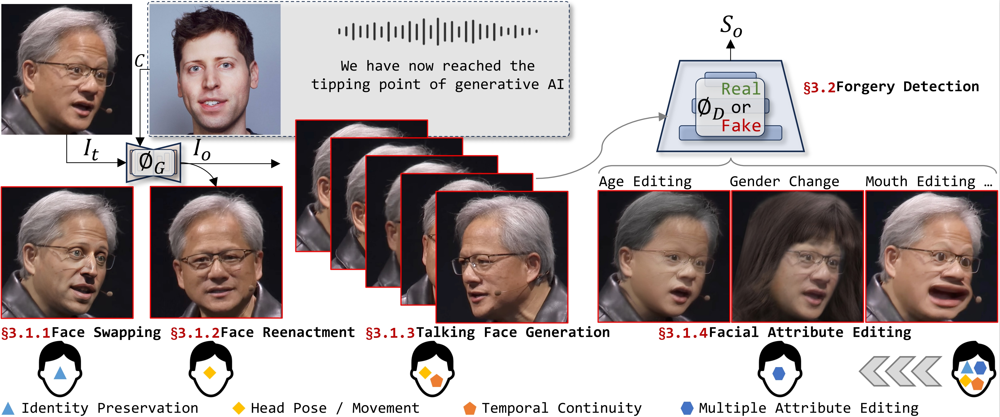

<p align="center">
     <a href="https://arxiv.org/abs/2403.17881">

     </a>
   <p align="center">
    <a href="https://scholar.google.com.hk/citations?user=1yhGS5sAAAAJ&hl=zh-CN"><strong>Gan Pei <sup>1</sup><sup>*</sup></strong></a>
    .
    <a href="https://zhangzjn.github.io/"><strong>Jiangning Zhang <sup>2</sup><sup>*</sup></strong></a>
    .
    <a href="https://scholar.google.com.hk/citations?user=8-Vo9cUAAAAJ&hl=zh-CN"><strong>Menghan Hu<sup>1</sup></strong></a>
    .
    <a href="https://scholar.google.com.hk/citations?hl=zh-CN&user=4daxK2AAAAAJ"><strong>Zhenyu Zhang<sup>3</sup></strong></a>
    .
    <a href="https://scholar.google.com.hk/citations?hl=zh-CN&user=fqte5H4AAAAJ"><strong>Chengjie Wang<sup>2</sup></strong></a>
    .
    <a href="https://github.com/flyingby/Awesome-Deepfake-Generation-and-Detection"><strong>Yunsheng Wu<sup>2</sup></strong></a>.
    <p align="center">
    <a href="https://scholar.google.com.hk/citations?user=E6zbSYgAAAAJ&hl=zh-CN"><strong>Guangtao Zhai<sup>4</sup></strong></a>
    .
    <a href="https://scholar.google.com.hk/citations?hl=zh-CN&user=6CIDtZQAAAAJ"><strong>Jian Yang<sup>3</sup></strong></a>
    .
    <a href="https://scholar.google.com.hk/citations?user=Ljk2BvIAAAAJ&hl=zh-CN&oi=ao"><strong>Chunhua Shen<sup>5</sup></strong></a> 
    .
    <a href="https://scholar.google.com.hk/citations?user=RwlJNLcAAAAJ&hl=zh-CN&oi=ao"><strong>Dacheng Tao<sup>6</sup></strong></a>
</p>
<p align="center">
    <strong><sup>1</sup>East China Normal University</strong> &nbsp;&nbsp;&nbsp; <strong><sup>2</sup>Tencent Youtu Lab</strong> &nbsp;&nbsp;&nbsp; <strong><sup>3</sup>Nanjing University</strong> &nbsp;&nbsp;&nbsp; <strong><sup>4</sup>Shanghai Jiao Tong University</strong>
    <br>
    <strong><sup>5</sup>Zhejiang University</strong>  &nbsp;&nbsp;&nbsp; <strong><sup>6</sup>Nanyang Technological University</strong>
    
<p align="center">
    <a href='https://arxiv.org/abs/2403.17881'>
      
         </a>
  

# We research Deepfake Generation and Detection

This work focuses on the aspect of facial manipulation in Deepfake, encompassing **Face Swapping**, **Face Reenactment**,  **Talking Face Generation**, **Face Attribute Editing** and **Forgery Detection**. We believe this will be the most comprehensive survey to date on facial manipulation and detection technologies. Please stay tuned!😉😉😉

### ✨You are welcome to provide us your work with a topic related to deepfake generation or detection!!!

If you discover any missing work or have any suggestions, please feel free to submit a [pull request](https://github.com/flyingby/Awesome-Deepfake-Generation-and-Detection/issues) or [contact us](#contact). We will promptly add the missing papers to this repository.

###  ✨Highlight!!!

[1]  A comprehensive survey for visual Deepfake, including Deepfake generation/detection.

[2]  It also contains several related domains, including Heas Swapping, Face Super-resolution, Face Reconstruction, Face Inpainting, Body Animation, Portrait Style Transfer, Makeup Transfer and Adversarial Sample Detection. 

[3]  We list detailed results for the most representative works.

### ✨Survey pipeline


## Introduction

This work presents a detailed survey on generation and detection tasks about face-related generation, including **Face Swapping**, **Face Reenactment**, **Talking Face Generation**, and **Face Attribute Editing**. In addition, we also introduce several related fields such as Head Swap, Face Super-resolution, Face Reconstruction, Face Inpainting, etc., and select some of them to expand.

</p>


## Summary of Contents
- [Introduction](#introduction)
- [Summary of Contents](#summary-of-contents)
- [Methods: A Survey](#methods-a-survey)
  - [Face Swapping](#Face-Swapping)
  - [Face Reenactment](#Face-Reenactment)
  - [Talking Face Generation](#Talking-Face-Generation)
  - [Facial Attribute Editing](#Facial-Attribute-Editing)
  - [Forgery Detection](#Forgery-Detection) 
- [Related Research Domains](#Related-Research-Domains)
  - [Face Super-resolution](#Face-Super-resolution) 
  - [Portrait Style Transfer](#Portrait-Style-Transfer)
  - [Body Animation](#Body-Animation)
  - [Makeup Transfer](#Makeup-Transfer)
- [Cite The Survey](#Cite-The-Survey)
- [Contact](#contact)


## Methods: A Survey

### Face Swapping
|Year|Venue|Category|Paper Title|Code|
|:-:|:-:|:-:|-|-|
|2025|WACV|Difussion|[Realistic and Efficient Face Swapping: A Unified Approach with Diffusion Models](https://arxiv.org/abs/2409.07269)|[Code](https://github.com/Sanoojan/REFace)|
|2024|arXiv|Diffusion|[HiFiVFS: High Fidelity Video Face Swapping](https://arxiv.org/abs/2411.18293)|-|
|2024|arXiv|Diffusion|[FuseAnyPart: Diffusion-Driven Facial Parts Swapping via Multiple Reference Images](https://arxiv.org/abs/2410.22771)|[Code](https://github.com/Thomas-wyh/FuseAnyPart)|
|2024|arXiv|GANs|[Active Fake: DeepFake Camouflage](https://arxiv.org/abs/2409.03200)|-|
|2024|arXiv|Other|[Rank-based No-reference Quality Assessment for Face Swapping](https://arxiv.org/abs/2406.01884)|-|
|2024|arXiv|3DGS|[ImplicitDeepfake: Plausible Face-Swapping through Implicit Deepfake Generation using NeRF and Gaussian Splatting](https://arxiv.org/abs/2402.06390)|[Code](https://github.com/quereste/implicit-deepfake)|
|2024|arXiv|GANs|[LatentSwap: An Efficient Latent Code Mapping Framework for Face Swapping](https://arxiv.org/abs/2402.18351)|-|
|2024|arXiv|VAEs|[SelfSwapper: Self-Supervised Face Swapping via Shape Agnostic Masked AutoEncoder](https://arxiv.org/abs/2402.07370)|-|
|2024|arXiv|Difussion|[Face Swap via Diffusion Model](https://arxiv.org/abs/2403.01108)|[Code](https://github.com/somuchtome/faceswap)|
|2024|arXiv|GANs|[E4S: Fine-grained Face Swapping via Editing With Regional GAN Inversion](https://arxiv.org/abs/2310.15081)|[Code](https://e4s2024.github.io/)|
|2024|ACM MM|VAEs|[CodeSwap: Symmetrically Face Swapping Based on Prior Codebook](https://openreview.net/forum?id=TYbuVVM3iR)|[Code](https://github.com/ICTMCG/CSCS)|
|2024|ACM TOG|GANs|[Identity-Preserving Face Swapping via Dual Surrogate Generative Models](https://dl.acm.org/doi/abs/10.1145/3676165?casa_token=ftkZx-RX6tsAAAAA:TKCR4gcHy9tWrY3UqJ6I6CV1dTQmCBXbjqk17I1Pz6ibgU45yF3F0i586RjdFkjhwTqxUoIvV9aJ)|[Code](https://github.com/ICTMCG/CSCS)|
|2024|ESWA|GANs|[Face swapping with adaptive exploration-fusion mechanism and dual en-decoding tactic](https://www.sciencedirect.com/science/article/pii/S0957417424016890)|-|
|2024|ECCV|Diffusion|[Face Adapter for Pre-Trained Diffusion Models with Fine-Grained ID and Attribute Control](https://arxiv.org/abs/2405.12970)|[Code](https://faceadapter.github.io/face-adapter.github.io/)|
|2024|T-PAMI|GANs|[Learning Disentangled Representation for One-Shot Progressive Face Swapping](https://ieeexplore.ieee.org/abstract/document/10536627)|[Code](https://github.com/liqi-casia/FaceSwapper)|
|2024|CVPR|Difussion|[Towards a Simultaneous and Granular Identity-Expression Control in Personalized Face Generation](https://openaccess.thecvf.com/content/CVPR2024/html/Liu_Towards_a_Simultaneous_and_Granular_Identity-Expression_Control_in_Personalized_Face_CVPR_2024_paper.html)|[Code](https://diffsfsr.github.io/)|
|2024|ICIP|Graphic|[RID-TWIN: An end-to-end pipeline for automatic face de-identification in videos](https://arxiv.org/abs/2403.10058)|[Code](https://github.com/AnirbanMukherjeeXD/RID-Twin)|
|2024|TCSVT|VAE|[Identity-Aware Variational Autoencoder for Face Swapping](https://ieeexplore.ieee.org/abstract/document/10380597/)|-|
|2024|ICASSP|GANs+3D|[Attribute-Aware Head Swapping Guided by 3d Modeling](https://ieeexplore.ieee.org/abstract/document/10446993)|-|
|2024|TMM|Other|[An Efficient Attribute-Preserving Framework for Face Swapping](https://ieeexplore.ieee.org/abstract/document/10400952)|-|
|2024|TMM|GANs+3D|[StableSwap: Stable Face Swapping in a Shared and Controllable Latent Space](https://ieeexplore.ieee.org/abstract/document/10444967)|-|
|2023|arXiv|GANs|[FlowFace++: Explicit Semantic Flow-supervised End-to-End Face Swapping](https://arxiv.org/abs/2306.12686)|-|
|2023|arXiv|GANs|[End-to-end Face-swapping via Adaptive Latent Representation Learning](https://arxiv.org/abs/2303.04186)|-|
|2023|arXiv|Difussion|[A Generalist FaceX via Learning Unified Facial Representation](https://arxiv.org/abs/2401.00551)|[Code](https://diffusion-facex.github.io/)|
|2023|arXiv|Cycle triplets|[ReliableSwap: Boosting General Face Swapping Via Reliable Supervision](https://arxiv.org/abs/2306.05356)|[Code](https://github.com/ygtxr1997/ReliableSwap)|
|2023|WACV|VAEs|[FaceOff: A Video-to-Video Face Swapping System](https://openaccess.thecvf.com/content/WACV2023/html/Agarwal_FaceOff_A_Video-to-Video_Face_Swapping_System_WACV_2023_paper.html)|-|
|2023|CVPR|GANs+3DMM|[StyleIPSB: Identity-Preserving Semantic Basis of StyleGAN for High Fidelity Face Swapping](https://openaccess.thecvf.com/content/CVPR2023/html/Jiang_StyleIPSB_Identity-Preserving_Semantic_Basis_of_StyleGAN_for_High_Fidelity_Face_CVPR_2023_paper.html)|[Code](https://github.com/a686432/StyleIPSB)|
|2023|CVPR|GANs+3DMM|[3D-Aware Face Swapping](https://openaccess.thecvf.com/content/CVPR2023/html/Li_3D-Aware_Face_Swapping_CVPR_2023_paper.html)|[Code](https://lyx0208.github.io/3dSwap/)|
|2023|CVPR|GANs|[Fine-Grained Face Swapping via Regional GAN Inversion](https://openaccess.thecvf.com/content/CVPR2023/html/Liu_Fine-Grained_Face_Swapping_via_Regional_GAN_Inversion_CVPR_2023_paper.html)|[Code](https://github.com/e4s2022/e4s)|
|2023|WACV|GANs|[FastSwap: A Lightweight One-Stage Framework for Real-Time Face Swapping](https://openaccess.thecvf.com/content/WACV2023/html/Yoo_FastSwap_A_Lightweight_One-Stage_Framework_for_Real-Time_Face_Swapping_WACV_2023_paper.html)|[Code](https://github.com/sahngmin/fastswap)|
|2023|TECS|GANs+VAEs|[XimSwap: many-to-many face swapping for TinyML](https://dl.acm.org/doi/full/10.1145/3603173)|-|
|2023|WACV|GANs|[FaceDancer: Pose- and Occlusion-Aware High Fidelity Face Swapping](https://openaccess.thecvf.com/content/WACV2023/html/Rosberg_FaceDancer_Pose-_and_Occlusion-Aware_High_Fidelity_Face_Swapping_WACV_2023_paper.html)|[Code](https://github.com/felixrosberg/FaceDancer)|
|2023|ICCV|GANs|[BlendFace: Re-designing Identity Encoders for Face-Swapping](https://openaccess.thecvf.com/content/ICCV2023/html/Shiohara_BlendFace_Re-designing_Identity_Encoders_for_Face-Swapping_ICCV_2023_paper.html)|[Code](https://github.com/mapooon/BlendFace)|
|2023|ICCV|GANs+3DMM|[Reinforced Disentanglement for Face Swapping without Skip Connection](https://openaccess.thecvf.com/content/ICCV2023/html/Ren_Reinforced_Disentanglement_for_Face_Swapping_without_Skip_Connection_ICCV_2023_paper.html)|-|
|2023|CVPR|GANs|[Attribute-preserving Face Dataset Anonymization via Latent Code Optimizatio](https://openaccess.thecvf.com/content/CVPR2023/html/Barattin_Attribute-Preserving_Face_Dataset_Anonymization_via_Latent_Code_Optimization_CVPR_2023_paper.html)|[Code](https://github.com/chi0tzp/FALCO)|
|2023|AAAI|GANs+3DMM|[FlowFace: Semantic Flow-Guided Shape-Aware Face Swapping](https://ojs.aaai.org/index.php/AAAI/article/view/25444)|-|
|2023|CVPR|Transformers|[Face Transformer: Towards High Fidelity and Accurate Face Swapping](https://openaccess.thecvf.com/content/CVPR2023W/GCV/html/Cui_Face_Transformer_Towards_High_Fidelity_and_Accurate_Face_Swapping_CVPRW_2023_paper.html)|-|
|2023|ACM MM|GANs+3D|[High Fidelity Face Swapping via Semantics Disentanglement and Structure Enhancement](https://dl.acm.org/doi/abs/10.1145/3581783.3612215)|-|
|2023|FG|Transformers|[TransFS: Face Swapping Using Transformer](https://ieeexplore.ieee.org/abstract/document/10042556)|-|
|2023|CVPR|Difussion|[DiffSwap: High-Fidelity and Controllable Face Swapping via 3D-Aware Masked Diffusion](https://openaccess.thecvf.com/content/CVPR2023/html/Zhao_DiffSwap_High-Fidelity_and_Controllable_Face_Swapping_via_3D-Aware_Masked_Diffusion_CVPR_2023_paper.html)|[Code](https://github.com/wl-zhao/DiffSwap)|
|2022|arXiv|Difussion|[DiffFace: Diffusion-based Face Swapping with Facial Guidance](https://arxiv.org/abs/2212.13344)|[Code](https://hxngiee.github.io/DiffFace/)|
|2022|AAAI|GANs|[MobileFaceSwap: A Lightweight Framework for Video Face Swapping](https://ojs.aaai.org/index.php/AAAI/article/view/20203)|[Code](https://github.com/Seanseattle/MobileFaceSwap)|
|2022|T-PAMI|GANs|[FSGANv2: Improved Subject Agnostic Face Swapping and Reenactment](https://ieeexplore.ieee.org/abstract/document/9763438)|[Code](https://github.com/YuvalNirkin/fsgan)|
|2022|ICME|GANs|[Migrating face swap to mobile devices: a lightweight framework and a supervised training solution](https://ieeexplore.ieee.org/abstract/document/9859806)|[Code](https://github.com/HoiM/MobileFSGAN)|
|2022|ECCV|GANs|[StyleSwap: Style-Based Generator Empowers Robust Face Swapping](https://link.springer.com/chapter/10.1007/978-3-031-19781-9_38)|[Code](https://github.com/Seanseattle/StyleSwap)|
|2022|ECCV|GANs|[Designing One Unified Framework for High-Fidelity Face Reenactment and Swapping](https://link.springer.com/chapter/10.1007/978-3-031-19784-0_4)|[Code](https://github.com/xc-csc101/UniFace)|
|2022|ECCV|GANs+3DMM|[MFIM: Megapixel Facial Identity Manipulation](https://link.springer.com/chapter/10.1007/978-3-031-19778-9_9)|-|
|2022|CVPR|GANs|[Region-Aware Face Swapping](https://openaccess.thecvf.com/content/CVPR2022/html/Xu_Region-Aware_Face_Swapping_CVPR_2022_paper.html)|[Code](https://github.com/xc-csc101/RAFSwap)|
|2022|CVPR|Difussion|[Smooth-Swap: A Simple Enhancement for Face-Swapping with Smoothness](https://openaccess.thecvf.com/content/CVPR2022/html/Kim_Smooth-Swap_A_Simple_Enhancement_for_Face-Swapping_With_Smoothness_CVPR_2022_paper.html)|-|
|2022|CVPR|GANs|[High-resolution Face Swapping via Latent Semantics Disentanglement](https://openaccess.thecvf.com/content/CVPR2022/html/Xu_High-Resolution_Face_Swapping_via_Latent_Semantics_Disentanglement_CVPR_2022_paper.html)|[Code](https://github.com/cnnlstm/FSLSD_HiRes)|
|2021|CVPR|GANs+3DMM|[FaceInpainter: High Fidelity Face Adaptation to Heterogeneous Domains](https://openaccess.thecvf.com/content/CVPR2021/html/Li_FaceInpainter_High_Fidelity_Face_Adaptation_to_Heterogeneous_Domains_CVPR_2021_paper.html?ref=https://githubhelp.com)|-|
|2021|CVPR|GANs|[Information Bottleneck Disentanglement for Identity Swapping](https://openaccess.thecvf.com/content/CVPR2021/html/Gao_Information_Bottleneck_Disentanglement_for_Identity_Swapping_CVPR_2021_paper.html?ref=https://githubhelp.com)|-|
|2021|CVPR|GANs|[One Shot Face Swapping on Megapixels](https://openaccess.thecvf.com/content/CVPR2021/html/Zhu_One_Shot_Face_Swapping_on_Megapixels_CVPR_2021_paper.html)|[Code](https://github.com/zyainfal/One-Shot-Face-Swapping-on-Megapixels)|
|2021|MMM|GANs|[Deep Face Swapping via Cross-Identity Adversarial Training](https://link.springer.com/chapter/10.1007/978-3-030-67835-7_7)|-|
|2021|IJCAI|GANs+3DMM|[HifiFace: 3D Shape and Semantic Prior Guided High Fidelity Face Swapping](https://arxiv.org/abs/2106.09965)|[Code](https://github.com/johannwyh/HifiFace)|
|2020|CVPR|GANs|[FaceShifter: Towards High Fidelity And Occlusion Aware Face Swapping](https://arxiv.org/abs/1912.13457)|[Code](https://lingzhili.com/FaceShifterPage/)|
|2020|CVPR|GANs|[DeepFaceLab: Integrated, flexible and extensible face-swapping framework](https://arxiv.org/abs/2005.05535)|[Code](https://github.com/iperov/DeepFaceLab)|
|2020|NeurIPS|GANs|[AOT: Appearance Optimal Transport Based Identity Swapping for Forgery Detection](https://proceedings.neurips.cc/paper_files/paper/2020/hash/f718499c1c8cef6730f9fd03c8125cab-Abstract.html)|[Code](https://github.com/zhuhaozh/AOT)|
|2020|ACM MM|GANs+VAEs|[SimSwap: An Efficient Framework For High Fidelity Face Swapping](https://dl.acm.org/doi/abs/10.1145/3394171.3413630)|[Code](https://github.com/neuralchen/SimSwap)|
|2020|AAAI|GANs+VAEs|[Deepfakes for Medical Video De-Identification: Privacy Protection and Diagnostic Information Preservation](https://dl.acm.org/doi/abs/10.1145/3375627.3375849)|-|


### Face Reenactment
|Year|Venue|Paper Title|Code|
|:-:|:-:|-|-|
|2024|arXiv|[MIMAFace: Face Animation via Motion-Identity Modulated Appearance Feature Learning](https://arxiv.org/abs/2409.15179)|[Code](https://mimaface2024.github.io/mimaface.github.io)|
|2024|arXiv|[Follow-Your-Emoji: Fine-Controllable and Expressive Freestyle Portrait Animation](https://arxiv.org/abs/2406.01900)|[Code](https://follow-your-emoji.github.io/)|
|2024|arXiv|[LivePortrait: Efficient Portrait Animation with Stitching and Retargeting Control](https://arxiv.org/pdf/2407.03168)|[Code](https://liveportrait.github.io/)|
|2024|arXiv|[Anchored Diffusion for Video Face Reenactment](https://arxiv.org/pdf/2407.15153)|-|
|2024|arXiv|[Learning Online Scale Transformation for Talking Head Video Generation](https://arxiv.org/abs/2407.09965)|-|
|2024|arXiv|[VOODOO XP: Expressive One-Shot Head Reenactment for VR Telepresence](https://arxiv.org/abs/2405.16204)|-|
|2024|arXiv|[3DFlowRenderer: One-shot Face Re-enactment via Dense 3D Facial Flow Estimation](https://arxiv.org/abs/2404.14667)|[Code](https://export3d.github.io/)|
|2024|arXiv|[MegActor: Harness the Power of Raw Video for Vivid Portrait Animation](https://arxiv.org/abs/2405.20851)|[Code](https://github.com/megvii-research/MegFaceAnimate)|
|2024|arXiv|[Export3D: Learning to Generate Conditional Tri-plane for 3D-aware Expression-Controllable Portrait Animation](https://arxiv.org/abs/2404.00636)|[Code](https://export3d.github.io/)|
|2024|arXiv|[Learning to Generate Conditional Tri-plane for 3D-aware Expression Controllable Portrait Animation](https://arxiv.org/abs/2404.00636)|[Code](https://export3d.github.io/)|
|2024|arXiv|[Superior and Pragmatic Talking Face Generation with Teacher-Student Framework](https://scholar.google.com.hk/scholar?hl=zh-CN&as_sdt=0%2C5&q=Superior+and+Pragmatic+Talking+Face+Generation+with+Teacher-Student+Framework&btnG=)|[Code](https://superfacelink.github.io/)|
|2024|arXiv|[DiffusionAct: Controllable Diffusion Autoencoder for One-shot Face Reenactment](https://arxiv.org/abs/2403.17217)|[Code](https://stelabou.github.io/diffusionact/)|
|2024|SIGGRAPH|[X-portrait: Expressive portrait animation with hierarchical motion attention](https://dl.acm.org/doi/abs/10.1145/3641519.3657459)|-|
|2024|BMVC|[G3FA: Geometry-guided GAN for Face Animation](http://arxiv.org/abs/2408.13049v1) |[Code](https://github.com/dfki-av/G3FA)|
|2024|ECCV|[Face Adapter for Pre-Trained Diffusion Models with Fine-Grained ID and Attribute Control](https://arxiv.org/abs/2405.12970)|[Code](https://faceadapter.github.io/face-adapter.github.io/)|
|2024|WACV|[CVTHead: One-shot Controllable Head Avatar with Vertex-feature Transformer](https://openaccess.thecvf.com/content/WACV2024/html/Ma_CVTHead_One-Shot_Controllable_Head_Avatar_With_Vertex-Feature_Transformer_WACV_2024_paper.html)|[Code](https://github.com/HowieMa/CVTHead)|
|2024|CVPR|[Pose Adapted Shape Learning for Large-Pose Face Reenactment](https://openaccess.thecvf.com/content/CVPR2024/html/Hsu_Pose_Adapted_Shape_Learning_for_Large-Pose_Face_Reenactment_CVPR_2024_paper.html)|[Code](https://github.com/AvLab-CV/PASL)|
|2024|CVPR|[FSRT: Facial Scene Representation Transformer for Face Reenactment from Factorized Appearance, Head-pose, and Facial Expression Features](https://arxiv.org/abs/2404.09736)|[Code](https://andrerochow.github.io/fsrt)|
|2024|ICASSP|[Expression Domain Translation Network for Cross-Domain Head Reenactment](https://scholar.google.com.hk/scholar?hl=zh-CN&as_sdt=0%2C5&q=Expression+Domain+Translation+Network+for+Cross-Domain+Head+Reenactment&btnG=)|-|
|2024|AAAI|[Learning Dense Correspondence for NeRF-Based Face Reenactment](https://ojs.aaai.org/index.php/AAAI/article/view/28473)|-|
|2024|AAAI|[FG-EmoTalk: Talking Head Video Generation with Fine-Grained Controllable Facial Expressions](https://ojs.aaai.org/index.php/AAAI/article/view/28309)|-|
|2024|IJCV|[One-shot Neural Face Reenactment via Finding Directions in GAN's Latent Space](https://link.springer.com/article/10.1007/s11263-024-02018-6)|-|
|2024|PR|[MaskRenderer: 3D-Infused Multi-Mask Realistic Face Reenactment](https://arxiv.org/abs/2309.05095)|-|
|2023|T-PAMI|[Free-headgan: Neural talking head synthesis with explicit gaze control](https://ieeexplore.ieee.org/abstract/document/10061572/)|-|
|2023|CVPR|[High-Fidelity and Freely Controllable Talking Head Video Generation](http://openaccess.thecvf.com/content/CVPR2023/html/Gao_High-Fidelity_and_Freely_Controllable_Talking_Head_Video_Generation_CVPR_2023_paper.html)|[Code](https://yuegao.me/PECHead)|
|2023|NeurIPS|[Learning Motion Refinement for Unsupervised Face Animation](https://proceedings.neurips.cc/paper_files/paper/2023/hash/df2df463f98abc4de7734dbd0b0dc49d-Abstract-Conference.html)|[Code](https://github.com/JialeTao/MRFA/)|
|2023|ICCV|[Robust One-Shot Face Video Re-enactment using Hybrid Latent Spaces of StyleGAN2](http://openaccess.thecvf.com/content/ICCV2023/html/Oorloff_Robust_One-Shot_Face_Video_Re-enactment_using_Hybrid_Latent_Spaces_of_ICCV_2023_paper.html)|[Code](https://trevineoorloff.github.io/FaceVideoReenactment_HybridLatents.io/)|
|2023|ICCV|[ToonTalker: Cross-Domain Face Reenactment](http://openaccess.thecvf.com/content/ICCV2023/html/Gong_ToonTalker_Cross-Domain_Face_Reenactment_ICCV_2023_paper.html)|-|
|2023|ICCV|[HyperReenact: One-Shot Reenactment via Jointly Learning to Refine and Retarget Faces](http://openaccess.thecvf.com/content/ICCV2023/html/Bounareli_HyperReenact_One-Shot_Reenactment_via_Jointly_Learning_to_Refine_and_Retarget_ICCV_2023_paper.html)|[Code](https://github.com/StelaBou/HyperReenact)|
|2023|CVPR|[MetaPortrait: Identity-Preserving Talking Head Generation with Fast Personalized Adaptation](http://openaccess.thecvf.com/content/CVPR2023/html/Zhang_MetaPortrait_Identity-Preserving_Talking_Head_Generation_With_Fast_Personalized_Adaptation_CVPR_2023_paper.html)|[Code](https://github.com/Meta-Portrait/MetaPortrait)|
|2023|CVPR|[Parametric Implicit Face Representation for Audio-Driven Facial Reenactment](http://openaccess.thecvf.com/content/CVPR2023/html/Huang_Parametric_Implicit_Face_Representation_for_Audio-Driven_Facial_Reenactment_CVPR_2023_paper.html)|-|
|2023|CVPR|[One-shot high-fidelity talking-head synthesis with deformable neural radiance field](http://openaccess.thecvf.com/content/CVPR2023/html/Li_One-Shot_High-Fidelity_Talking-Head_Synthesis_With_Deformable_Neural_Radiance_Field_CVPR_2023_paper.html)|[Code](https://www.waytron.net/hidenerf/)|
|2023|FG|[Stylemask: Disentangling the style space of stylegan2 for neural face reenactment](https://ieeexplore.ieee.org/abstract/document/10042744/)|[Code](https://github.com/StelaBou/StyleMask.)|
|2022|ECCV|[Face2Faceρ: Real-Time High-Resolution One-Shot Face Reenactment](https://link.springer.com/chapter/10.1007/978-3-031-19778-9_4)|-|
|2022|CVPR|[Dual-Generator Face Reenactment](https://openaccess.thecvf.com/content/CVPR2022/html/Hsu_Dual-Generator_Face_Reenactment_CVPR_2022_paper.html)|-|
|2021|ICCV|[PIRenderer: Controllable Portrait Image Generation via Semantic Neural Rendering](http://openaccess.thecvf.com/content/ICCV2021/html/Ren_PIRenderer_Controllable_Portrait_Image_Generation_via_Semantic_Neural_Rendering_ICCV_2021_paper.html)|[Code](https://github.com/RenYurui/PIRender)|
|2021|ICCV|[Headgan: One-shot neural head synthesis and editing](http://openaccess.thecvf.com/content/ICCV2021/html/Doukas_HeadGAN_One-Shot_Neural_Head_Synthesis_and_Editing_ICCV_2021_paper.html)|-|
|2020|CVPR|[FReeNet: Multi-Identity Face Reenactment](http://openaccess.thecvf.com/content_CVPR_2020/html/Zhang_FReeNet_Multi-Identity_Face_Reenactment_CVPR_2020_paper.html)|-|
|2020|FG|[Head2Head: Videobased neural head synthesis](https://ieeexplore.ieee.org/abstract/document/9320155/)|-|
|2020|ECCV|[Fast bilayer neural synthesis of one-shot realistic head avatars](https://link.springer.com/chapter/10.1007/978-3-030-58610-2_31)|-|
|2020|AAAI|[MarioNETte: Few-Shot Face Reenactment Preserving Identity of Unseen Targets](https://aaai.org/ojs/index.php/AAAI/article/view/6721)|-|
|2019|ACM TOG|[Deferred Neural Rendering: Image Synthesis using Neural Textures](https://dl.acm.org/doi/abs/10.1145/3306346.3323035)|-|
|2019|ACM TOG|[Neural style-preserving visual dubbing](https://dl.acm.org/doi/abs/10.1145/3355089.3356500)|-|
|2019|ICCV|[Few-Shot Adversarial Learning of Realistic Neural Talking Head Models](http://openaccess.thecvf.com/content_ICCV_2019/html/Zakharov_Few-Shot_Adversarial_Learning_of_Realistic_Neural_Talking_Head_Models_ICCV_2019_paper.html)|-|
|2018|CVPR|[X2Face: A network for controlling face generation using images, audio, and pose codes](http://openaccess.thecvf.com/content_ECCV_2018/html/Olivia_Wiles_X2Face_A_network_ECCV_2018_paper.html)|-|
|2018|ACM TOG|[Deep video portraits](https://dl.acm.org/doi/abs/10.1145/3197517.3201283)|-|
|2018|NeurIPS|[Video to video synthesis](https://scholar.google.com.hk/scholar?hl=zh-CN&as_sdt=0%2C5&q=Video+to+video+synthesis&btnG=)|[Code](https://github.com/NVIDIA/vid2vid)|
|2016|CVPR|[Face2Face: Real-time Face Capture and Reenactment of RGB Videos](http://openaccess.thecvf.com/content_cvpr_2016/html/Thies_Face2Face_Real-Time_Face_CVPR_2016_paper.html)|-|

### Talking Face Generation
|Year|Venue|Category|Paper Title|Code|
|:-:|:-:|:-:|-|-|
|2025|AAAI|VQ-VAE|[DEEPTalk: Dynamic Emotion Embedding for Probabilistic Speech-Driven 3D Face Animation](https://arxiv.org/abs/2408.06010)|-|
|2025|AAAI|Diffusion|[GoHD: Gaze-oriented and Highly Disentangled Portrait Animation with Rhythmic Poses and Realistic Expression](http://arxiv.org/abs/2412.09296v1)|[Code](https://github.com/Jia1018/GoHD)|
|2024|arXiv|Diffusion|[LatentSync: Audio Conditioned Latent Diffusion Models for Lip Sync](http://arxiv.org/abs/2412.09262v1)|-|
|2024|arXiv|Audio|[FLOAT: Generative Motion Latent Flow Matching for Audio-driven Talking Portrait](https://arxiv.org/abs/2412.01064)|[Code](https://deepbrainai-research.github.io/float/)|
|2024|arXiv|3D Model|[Audio-Driven Emotional 3D Talking-Head Generation](https://arxiv.org/abs/2410.17262)|-|
|2024|arXiv|3D Model|[Diverse Code Query Learning for Speech-Driven Facial Animation](https://arxiv.org/abs/2409.19143)|-|
|2024|arXiv|3D Model|[JambaTalk: Speech-Driven 3D Talking Head Generation Based on Hybrid Transformer-Mamba Model](https://arxiv.org/abs/2408.01627)|-|
|2024|arXiv|Diffusion|[EmotiveTalk: Expressive Talking Head Generation through Audio Information Decoupling and Emotional Video Diffusion](https://arxiv.org/abs/2411.16726)|-|
|2024|arXiv|3D Model|[LES-Talker: Fine-Grained Emotion Editing for Talking Head Generation in Linear Emotion Space](https://arxiv.org/abs/2411.09268)|-|
|2024|arXiv|3D Model|[3D-GS Talker: 3D Gaussian Based Audio-Driven Real-Time Talking Head Generation](https://www.researchsquare.com/article/rs-4558717/v1)|-|
|2024|arXiv|Diffusion|[JoyVASA: Portrait and Animal Image Animation with Diffusion-Based Audio-Driven Facial Dynamics and Head Motion Generation](http://arxiv.org/abs/2411.09209v1)|[Code](https://github.com/jdh-algo/JoyVASA)|
|2024|arXiv|Audio|[SPEAK: Speech-Driven Pose and Emotion-Adjustable Talking Head Generation](https://arxiv.org/abs/2405.07257)|[Code](https://anonymous.4open.science/r/SPEAK-8A22)|
|2024|arXiv|Audio|[DAWN: Dynamic Frame Avatar with Non-autoregressive Diffusion Framework for Talking Head Video Generation](https://arxiv.org/abs/2410.13726)|[Code](https://github.com/Hanbo-Cheng/DAWN-pytorch)|
|2024|arXiv|Audio|[MuseTalk: Real-Time High Quality Lip Synchronization with Latent Space Inpainting](https://arxiv.org/abs/2410.10122)|-|
|2024|arXiv|Audio|[LaDTalk: Latent Denoising for Synthesizing Talking Head Videos with High Frequency Details](http://arxiv.org/abs/2410.00990v1)|-|
|2024|arXiv|Diffusion|[DreamHead: Learning Spatial-Temporal Correspondence via Hierarchical Diffusion for Audio-driven Talking Head Synthesis](https://arxiv.org/abs/2409.10281)|-|
|2024|arXiv|KAN|[KAN-Based Fusion of Dual-Domain for Audio-Driven Facial Landmarks Generation](https://arxiv.org/abs/2409.05330)|-|
|2024|arXiv|GANs|[SegTalker: Segmentation-based Talking Face Generation with Mask-guided Local Editing](https://arxiv.org/abs/2409.03605)|-|
|2024|arXiv|Diffusion|[SVP: Style-Enhanced Vivid Portrait Talking Head Diffusion Model](https://arxiv.org/abs/2409.03270)|-|
|2024|arXiv|Diffusion|[PoseTalk: Text-and-Audio-based Pose Control and Motion Refinement for One-Shot Talking Head Generation](https://arxiv.org/abs/2409.02657)|[Code](https://junleen.github.io/projects/posetalk)|
|2024|arXiv|Audio|[JambaTalk: Speech-Driven 3D Talking Head Generation Based on Hybrid Transformer-Mamba Model](https://arxiv.org/abs/2408.01627)|-|
|2024|arXiv|Audio|[EmoFace: Emotion-Content Disentangled Speech-Driven 3D Talking Face with Mesh Attention](https://arxiv.org/abs/2408.11518)|-|
|2024|arXiv|Audio|[Meta-Learning Empowered Meta-Face: Personalized Speaking Style Adaptation for Audio-Driven 3D Talking Face Animation](https://arxiv.org/abs/2408.09357)|-|
|2024|arXiv|VQ-VAE|[GLDiTalker: Speech-Driven 3D Facial Animation with Graph Latent Diffusion Transformer](https://arxiv.org/abs/2408.01826v1)|-|
|2024|arXiv|Diffusion|[High-fidelity and Lip-synced Talking Face Synthesis via Landmark-based Diffusion Model](https://arxiv.org/abs/2408.05416)|-|
|2024|arXiv|Diffusion|[Style-Preserving Lip Sync via Audio-Aware Style Reference](https://arxiv.org/abs/2408.05412)|-|
|2024|arXiv|Diffusion|[Text-based Talking Video Editing with Cascaded Conditional Diffusion](https://arxiv.org/abs/2407.14841)|-|
|2024|arXiv|Audio|[Audio-driven High-resolution Seamless Talking Head Video Editing via StyleGAN](https://arxiv.org/abs/2407.05577)|-|
|2024|arXiv|Audio|[RealTalk: Real-time and Realistic Audio-driven Face Generation with 3D Facial Prior-guided Identity Alignment Network](https://arxiv.org/abs/2406.18284)|-|
|2024|arXiv|3D Model|[NLDF: Neural Light Dynamic Fields for Efficient 3D Talking Head Generation](https://arxiv.org/pdf/2406.11259)|-|
|2024|arXiv|Audio|[Emotional Conversation: Empowering Talking Faces with Cohesive Expression, Gaze and Pose Generation](https://arxiv.org/abs/2406.07895)|-|
|2024|arXiv|Audio|[Controllable Talking Face Generation by Implicit Facial Keypoints Editing](https://arxiv.org/pdf/2406.02880)|[Code](https://github.com/NetEase-Media/ControlTalk)|
|2024|arXiv|Audio|[OpFlowTalker: Realistic and Natural Talking Face Generation via Optical Flow Guidance](https://arxiv.org/pdf/2405.14709)|-|
|2024|arXiv|Multimodal|[Listen, Disentangle, and Control: Controllable Speech-Driven Talking Head Generation](https://arxiv.org/abs/2405.07257)|[Code](https://anonymous.4open.science/r/SPEAK-F56E)|
|2024|arXiv|Audio|[AniTalker: Animate Vivid and Diverse Talking Faces through Identity-Decoupled Facial Motion Encoding](https://arxiv.org/abs/2405.03121)|[Code](https://github.com/X-LANCE/AniTalker)|
|2024|arXiv|3D Model|[NeRFFaceSpeech: One-shot Audio-driven 3D Talking Head Synthesis via Generative Prior](https://arxiv.org/abs/2405.05749)|[Code](https://rlgnswk.github.io/NeRFFaceSpeech_ProjectPage/)|
|2024|arXiv|Audio|[SwapTalk: Audio-Driven Talking Face Generation with One-Shot Customization in Latent Space](https://arxiv.org/abs/2405.05636)|[Code](http://swaptalk.cc/)|
|2024|arXiv|3D Model|[GSTalker: Real-time Audio-Driven Talking Face Generation via Deformable Gaussian Splatting](https://arxiv.org/abs/2404.19040)|-|
|2024|arXiv|3D Model|[Embedded Representation Learning Network for Animating Styled Video Portrait](https://arxiv.org/abs/2404.19038)|-|
|2024|arXiv|3D Model|[Learn2Talk: 3D Talking Face Learns from 2D Talking Face](https://arxiv.org/abs/2404.12888)|[Code](https://lkjkjoiuiu.github.io/Learn2Talk/)|
|2024|arXiv|3D Model|[GaussianTalker: Speaker-specific Talking Head Synthesis via 3D Gaussian Splatting](https://arxiv.org/abs/2404.14037)|[Code](https://yuhongyun777.github.io/GaussianTalker/)|
|2024|arXiv|Audio|[Emote Portrait Alive: Generating Expressive Portrait Videos with Audio2Video Diffusion Model under Weak Conditions](https://arxiv.org/abs/2402.17485)|[Code](https://github.com/HumanAIGC/EMO)|
|2024|arXiv|Audio|[VLOGGER: Multimodal Diffusion for Embodied Avatar Synthesis](https://arxiv.org/abs/2403.08764)|[Code](https://enriccorona.github.io/vlogger/)|
|2024|arXiv|Audio|[AniPortrait: Audio-Driven Synthesis of Photorealistic Portrait Animations](https://arxiv.org/abs/2403.17694)|[Code](https://github.com/Zejun-Yang/AniPortrait)|
|2024|arXiv|Audio|[Talk3D: High-Fidelity Talking Portrait Synthesis via Personalized 3D Generative Prior](https://arxiv.org/abs/2403.20153)|[Code](https://ku-cvlab.github.io/Talk3D/)|
|2024|arXiv|Diffusion|[MoDiTalker: Motion-Disentangled Diffusion Model for High-Fidelity Talking Head Generation](https://arxiv.org/abs/2403.19144)|-|
|2024|arXiv|Audio|[EmoVOCA: Speech-Driven Emotional 3D Talking Heads](https://arxiv.org/abs/2403.12886)|-|
|2024|arXiv|Diffusion|[Context-aware Talking Face Video Generation](https://arxiv.org/abs/2402.18092)|-|
|2024|arXiv|Audio|[EmoSpeaker: One-shot Fine-grained Emotion-Controlled Talking Face Generation](https://arxiv.org/abs/2402.01422)|-|
|2024|arXiv|Diffusion|[EMOdiffhead: Continuously Emotional Control in Talking Head Generation via](https://arxiv.org/pdf/2409.07255)|-|
|2024|TVCG|3D Model|[High-Fidelity and High-Efficiency Talking Portrait Synthesis With Detail-Aware Neural Radiance Fields](https://ieeexplore.ieee.org/abstract/document/10740602)|[Code](https://github.com/muyuWang/HHNeRF)|
|2024|ICIP|Audio|[Personatalk: Preserving Personalized Dynamic Speech Style In Talking Face Generation](https://ieeexplore.ieee.org/abstract/document/10647689)|-|
|2024|NIPS oral|Audio|[VASA-1: Lifelike Audio-Driven Talking Faces Generated in Real Time](https://arxiv.org/abs/2404.10667)|[Code](https://www.microsoft.com/en-us/research/project/vasa-1/)|
|2024|NIPS|3D Model|[MimicTalk: Mimicking a personalized and expressive 3D talking face in minutes](https://arxiv.org/pdf/2410.06734)|[Code](https://mimictalk.github.io/)|
|2024|SIGGRAPH|Multimodal|[Media2Face: Co-speech Facial Animation Generation With Multi-Modality Guidance](https://dl.acm.org/doi/abs/10.1145/3641519.3657413)|-|
|2024|SIGGRAPH|Audio|[ProbTalk3D: Non-Deterministic Emotion Controllable Speech-Driven 3D Facial Animation Synthesis Using VQ-VAE](https://arxiv.org/pdf/2409.07966)|[Code](https://github.com/uuembodiedsocialai/ProbTalk3D/)|
|2024|BMVC|3D Model|[JEAN: Joint Expression and Audio-guided NeRF-based Talking Face Generation](https://arxiv.org/abs/2409.12156)|[Code](https://starc52.github.io/publications/2024-07-19-JEAN)|
|2024|ACM MM|3D Model|[GaussianTalker: Real-Time High-Fidelity Talking Head Synthesis with Audio-Driven 3D Gaussian Splatting](https://arxiv.org/abs/2404.16012)|[Code](https://ku-cvlab.github.io/GaussianTalker)|
|2024|ACM MM|Diffusion|[ConsistentAvatar: Learning to Diffuse Fully Consistent Talking Head Avatar with Temporal Guidance](https://openreview.net/pdf?id=ZyKdUtuUjZ)|-|
|2024|ACM MM|Audio|[SegTalker: Segmentation-based Talking Face Generation with Mask-guided Local Editing](https://openreview.net/forum?id=z0OEHZbT71)|-|
|2024|ACM MM|Diffusion|[FD2Talk: Towards Generalized Talking Head Generation with Facial Decoupled Diffusion Model](https://arxiv.org/abs/2408.09384)|[Code](https://peterfanfan.github.io/EmoSpeaker/)|
|2024|ACM MM|Multimodal|[SyncTalklip: Highly Synchronized Lip-Readable Speaker Generation with Multi-Task Learning](https://openreview.net/forum?id=Hr5cO79Ajw)|[Code](https://sync-talklip.github.io/)|
|2024|VR|Audio|[EmoFace: Audio-driven Emotional 3D Face Animation](https://ieeexplore.ieee.org/abstract/document/10494180)|[Code](https://github.com/SJTU-Lucy/EmoFace)|
|2024|ECCV|Diffusion|[EMO: Emote Portrait Alive Generating Expressive Portrait Videos with Audio2Video Diffusion Model Under Weak Conditions](https://link.springer.com/chapter/10.1007/978-3-031-73010-8_15)|-|
|2024|ECCV|Audio|[Audio-driven Talking Face Generation with Stabilized Synchronization Loss](https://www.ecva.net/papers/eccv_2024/papers_ECCV/papers/02950.pdf)|-|
|2024|ECCV|Diffusion|[Stable Video Portraits](https://arxiv.org/abs/2409.18083)|[Code](https://svp.is.tue.mpg.de/)|
|2024|ECCV|3D Model|[S^3D-NeRF: Single-Shot Speech-Driven Neural Radiance Field for High Fidelity Talking Head Synthesis](https://arxiv.org/abs/2408.09347)|-|
|2024|ECCV|Audio|[KMTalk: Speech-Driven 3D Facial Animation with Key Motion Embedding](https://arxiv.org/abs/2409.01113)|[Code](https://github.com/ffxzh/KMTalk)|
|2024|ECCV|3D Model|[TalkingGaussian: Structure-Persistent 3D Talking Head Synthesis via Gaussian Splatting](https://arxiv.org/abs/2404.15264)|[Code](https://github.com/Fictionarry/TalkingGaussian)|
|2024|ECCV|Audio|[EDTalk: Efficient Disentanglement for Emotional Talking Head Synthesis](https://arxiv.org/abs/2404.01647)|[Code](https://tanshuai0219.github.io/EDTalk/)|
|2024|IJCV|Audio|[ReliTalk: Relightable Talking Portrait Generation from a Single Video](https://link.springer.com/article/10.1007/s11263-024-02007-9)|[Code](https://github.com/arthur-qiu/ReliTalk)|
|2024|TCSVT|Audio|[Audio-Semantic Enhanced Pose-Driven Talking Head Generation](https://ieeexplore.ieee.org/abstract/document/10557736)|[Code](https://headproject0.wixsite.com/anonymity)|
|2024|TCSVT|Audio|[OSM-Net: One-to-Many One-shot Talking Head Generation with Spontaneous Head Motions](https://ieeexplore.ieee.org/stamp/stamp.jsp?tp=&arnumber=10510337)|-|
|2024|IF|3D Model|[ER-NeRF++: Efficient region-aware Neural Radiance Fields for high-fidelity talking portrait synthesis](https://www.sciencedirect.com/science/article/abs/pii/S1566253524002343)|-|
|2024|ICLR|3D Model|[Real3D-Portrait: One-shot Realistic 3D Talking Portrait Synthesis](https://arxiv.org/abs/2401.08503)|[Code](https://real3dportrait.github.io/)|
|2024|ICLR|Diffusion|[GAIA: ZERO-SHOT TALKING AVATAR GENERATION](https://arxiv.org/abs/2311.15230)|[Code](https://microsoft.github.io/GAIA)|
|2024|T-PAMI|Multimodal|[StyleTalk++: A Unified Framework for Controlling the Speaking Styles of Talking Heads](https://ieeexplore.ieee.org/abstract/document/10413601/)|-|
|2024|ICASSP|Diffusion|[EmoTalker: Emotionally Editable Talking Face Generation via Diffusion Model](https://arxiv.org/abs/2401.08049)|-|
|2024|ICASSP|Text|[Text-Driven Talking Face Synthesis by Reprogramming Audio-Driven Models](https://ieeexplore.ieee.org/abstract/document/10448506/)|-|
|2024|ICASSP|Audio|[Speech-Driven Emotional 3d Talking Face Animation Using Emotional Embeddings](https://ieeexplore.ieee.org/abstract/document/10446842/)|-|
|2024|ICASSP|Audio|[Exploring Phonetic Context-Aware Lip-Sync for Talking Face Generation](https://ieeexplore.ieee.org/abstract/document/10447284/)|-|
|2024|ICASSP|Audio|[Talking Face Generation for Impression Conversion Considering Speech Semantics](https://ieeexplore.ieee.org/abstract/document/10446947/)|-|
|2024|ICASSP|3D Model|[NeRF-AD: Neural Radiance Field with Attention-based Disentanglement for Talking Face Synthesis](https://arxiv.org/abs/2401.12568)|[Code](https://xiaoxingliu02.github.io/NeRF-AD)|
|2024|ICASSP|3D Model|[DT-NeRF: Decomposed Triplane-Hash Neural Radiance Fields For High-Fidelity Talking Portrait Synthesis](https://ieeexplore.ieee.org/abstract/document/10448446/)|-|
|2024|ICASSP|Multimodal|[Talking Face Generation for Impression Conversion Considering Speech Semantics](https://ieeexplore.ieee.org/abstract/document/10446947/)|-|
|2024|ICAART|Diffusion|[DiT-Head: High-Resolution Talking Head Synthesis using Diffusion Transformers](https://arxiv.org/abs/2312.06400)|-|
|2024|WACV|Audio|[THInImg: Cross-Modal Steganography for Presenting Talking Heads in Images](https://openaccess.thecvf.com/content/WACV2024/html/Zhao_THInImg_Cross-Modal_Steganography_for_Presenting_Talking_Heads_in_Images_WACV_2024_paper.html)|-|
|2024|WACV|Diffusion|[Diffused Heads: Diffusion Models Beat GANs on Talking-Face Generation](https://openaccess.thecvf.com/content/WACV2024/html/Stypulkowski_Diffused_Heads_Diffusion_Models_Beat_GANs_on_Talking-Face_Generation_WACV_2024_paper.html)|[Code](https://mstypulkowski.github.io/diffusedheads/)|
|2024|WACV|Audio|[DR2: Disentangled Recurrent Representation Learning for Data-Efficient Speech Video Synthesis](https://openaccess.thecvf.com/content/WACV2024/html/Zhang_DR2_Disentangled_Recurrent_Representation_Learning_for_Data-Efficient_Speech_Video_Synthesis_WACV_2024_paper.html)|-|
|2024|WACV|Audio|[RADIO: Reference-Agnostic Dubbing Video Synthesis](https://openaccess.thecvf.com/content/WACV2024/html/Lee_RADIO_Reference-Agnostic_Dubbing_Video_Synthesis_WACV_2024_paper.html)|-|
|2024|WACV|Audio|[Diff2Lip: Audio Conditioned Diffusion Models for Lip-Synchronization](https://openaccess.thecvf.com/content/WACV2024/html/Mukhopadhyay_Diff2Lip_Audio_Conditioned_Diffusion_Models_for_Lip-Synchronization_WACV_2024_paper.html)|[Code](https://soumik-kanad.github.io/diff2lip)|
|2024|CVPR|Text|[FaceTalk: Audio-Driven Motion Diffusion for Neural Parametric Head Models](https://openaccess.thecvf.com/content/CVPR2024/html/Aneja_FaceTalk_Audio-Driven_Motion_Diffusion_for_Neural_Parametric_Head_Models_CVPR_2024_paper.html)|[Code](https://shivangi-aneja.github.io/projects/facetalk/)|
|2024|CVPR|Text|[Faces that Speak: Jointly Synthesising Talking Face and Speech from Text](https://openaccess.thecvf.com/content/CVPR2024/html/Jang_Faces_that_Speak_Jointly_Synthesising_Talking_Face_and_Speech_from_CVPR_2024_paper.html)|[Code](https://mm.kaist.ac.kr/projects/faces-that-speak)|
|2024|CVPR|Diffusion|[DiffTED: One-shot Audio-driven TED Talk Video Generation with Diffusion-based Co-speech Gestures](https://openaccess.thecvf.com/content/CVPR2024W/HuMoGen/html/Hogue_DiffTED_One-shot_Audio-driven_TED_Talk_Video_Generation_with_Diffusion-based_Co-speech_CVPRW_2024_paper.html)|-|
|2024|CVPR|Audio|[FaceChain-ImagineID: Freely Crafting High-Fidelity Diverse Talking Faces from Disentangled Audio](https://arxiv.org/abs/2403.01901)|[Code](https://github.com/modelscope/facechain)|
|2024|CVPR|Audio|[FlowVQTalker: High-Quality Emotional Talking Face Generation through Normalizing Flow and Quantization](https://openaccess.thecvf.com/content/CVPR2024/html/Tan_FlowVQTalker_High-Quality_Emotional_Talking_Face_Generation_through_Normalizing_Flow_and_CVPR_2024_paper.html)|-|
|2024|CVPR|Text|[Faces that Speak: Jointly Synthesising Talking Face and Speech from Text](https://arxiv.org/pdf/2405.10272)|[Code](https://mm.kaist.ac.kr/projects/faces-that-speak)|
|2024|CVPR|3D Model|[SyncTalk: The Devil is in the Synchronization for Talking Head Synthesis](https://arxiv.org/abs/2311.17590)|[Code](https://github.com/ZiqiaoPeng/SyncTalk)|
|2024|CVPR|3D Model|[Learning Dynamic Tetrahedra for High-Quality Talking Head Synthesis](https://arxiv.org/abs/2402.17364)|[Code](https://github.com/zhangzc21/DynTet)|
|2024|CVPRW|3D Model|[NeRFFaceSpeech: One-shot Audio-driven 3D Talking Head Synthesis via Generative Prior](http://arxiv.org/abs/2405.05749v2)|[Code](https://github.com/rlgnswk/NeRFFaceSpeech_Code/)|
|2024|AAAI|3D Model|[AE-NeRF: Audio Enhanced Neural Radiance Field for Few Shot Talking Head Synthesis](https://ojs.aaai.org/index.php/AAAI/article/view/28086)|-|
|2024|AAAI|3D Model|[Mimic: Speaking Style Disentanglement for Speech-Driven 3D Facial Animation](https://ojs.aaai.org/index.php/AAAI/article/view/27945) |[Code](https://github.com/huifu99/Mimic)|
|2024|AAAI|Audio|[Style2Talker: High-Resolution Talking Head Generation with Emotion Style and Art Style](https://ojs.aaai.org/index.php/AAAI/article/view/28313)|-|
|2024|AAAI|Audio|[AudioGPT: Understanding and Generating Speech, Music, Sound, and Talking Head](https://scholar.google.com.hk/scholar?hl=zh-CN&as_sdt=0%2C5&q=AudioGPT%3A+Understanding+and+Generating+Speech%2C+Music%2C+Sound%2C+and+Talking+Head&btnG=)|-|
|2024|AAAI|Audio|[Say Anything with Any Style](https://ojs.aaai.org/index.php/AAAI/article/view/28314)|-|
|2023|arXiv|Audio|[GMTalker: Gaussian Mixture based Emotional talking video Portraits](https://arxiv.org/abs/2312.07669)|[Code](https://bob35buaa.github.io/GMTalker)|
|2023|arXiv|Diffusion|[DREAM-Talk: Diffusion-based Realistic Emotional Audio-driven Method for Single Image Talking Face Generation](https://arxiv.org/abs/2312.13578)|[Code](https://magic-research.github.io/dream-talk/)|
|2023|arXiv|Diffusion|[DreamTalk: When Expressive Talking Head Generation Meets Diffusion Probabilistic Models](https://arxiv.org/abs/2312.09767)|[Code](https://dreamtalk-project.github.io/)|
|2023|arXiv|Text|[TalkCLIP: Talking Head Generation with Text-Guided Expressive Speaking Styles](https://arxiv.org/abs/2304.00334)|-|
|2023|CVPR|Multimodal|[High-Fidelity Generalized Emotional Talking Face Generation With Multi-Modal Emotion Space Learning](http://openaccess.thecvf.com/content/CVPR2023/html/Xu_High-Fidelity_Generalized_Emotional_Talking_Face_Generation_With_Multi-Modal_Emotion_Space_CVPR_2023_paper.html)|-|
|2023|CVPR|Multimodal|[LipFormer: High-fidelity and Generalizable Talking Face Generation with A Pre-learned Facial Codebook](http://openaccess.thecvf.com/content/CVPR2023/html/Wang_LipFormer_High-Fidelity_and_Generalizable_Talking_Face_Generation_With_a_Pre-Learned_CVPR_2023_paper.html)|-|
|2023|CVPR|Audio|[Sadtalker: Learning realistic 3d motion coefficients for stylized audio-driven single image talking face animation](http://openaccess.thecvf.com/content/CVPR2023/html/Zhang_SadTalker_Learning_Realistic_3D_Motion_Coefficients_for_Stylized_Audio-Driven_Single_CVPR_2023_paper.html)|[Code](https://sadtalker.github.io/)|
|2023|CVPR|Audio|[Seeing What You Said: Talking Face Generation Guided by a Lip Reading Expert](http://openaccess.thecvf.com/content/CVPR2023/html/Wang_Seeing_What_You_Said_Talking_Face_Generation_Guided_by_a_CVPR_2023_paper.html)|-|
|2023|ICCV|Audio|[Speech2Lip: High-fidelity Speech to Lip Generation by Learning from a Short Video](http://openaccess.thecvf.com/content/ICCV2023/html/Wu_Speech2Lip_High-fidelity_Speech_to_Lip_Generation_by_Learning_from_a_ICCV_2023_paper.html)|[Code](https://github.com/CVMI-Lab/Speech2Lip)|
|2023|ICCV|Audio|[EMMN: Emotional Motion Memory Network for Audio-driven Emotional Talking Face Generation](http://openaccess.thecvf.com/content/ICCV2023/html/Tan_EMMN_Emotional_Motion_Memory_Network_for_Audio-driven_Emotional_Talking_Face_ICCV_2023_paper.html)|-|
|2023|TNNLS|Audio|[Talking Face Generation With Audio-Deduced Emotional Landmarks](https://ieeexplore.ieee.org/abstract/document/10130452/)|-|
|2023|ICASSP|Audio|[Memory-augmented contrastive learning for talking head generation](https://ieeexplore.ieee.org/abstract/document/10096593/)|[Code](https://github.com/Yaxinzhao97/MACL.git)|
|2023|CVPR|Audio|[Identity-Preserving Talking Face Generation with Landmark and Appearance Priors](http://openaccess.thecvf.com/content/CVPR2023/html/Zhong_Identity-Preserving_Talking_Face_Generation_With_Landmark_and_Appearance_Priors_CVPR_2023_paper.html)|[Code](https://github.com/Weizhi-Zhong/IP_LAP)|
|2023|TCSVT|Audio|[Stochastic Latent Talking Face Generation Towards Emotional Expressions and Head Poses](https://ieeexplore.ieee.org/abstract/document/10237279/)|-|
|2023|ICCV|Audio|[Efficient Emotional Adaptation for Audio-Driven Talking-Head Generation](http://openaccess.thecvf.com/content/ICCV2023/html/Gan_Efficient_Emotional_Adaptation_for_Audio-Driven_Talking-Head_Generation_ICCV_2023_paper.html)|[Code](https://github.com/yuangan/EAT_code)|
|2023|Displays|Audio|[Talking face generation driven by time–frequency domain features of speech audio](https://www.sciencedirect.com/science/article/pii/S0141938223001919)|-|
|2023|ICCV|Diffusion|[Talking Head Generation with Probabilistic Audio-to-Visual Diffusion Priors](http://openaccess.thecvf.com/content/ICCV2023/html/Yu_Talking_Head_Generation_with_Probabilistic_Audio-to-Visual_Diffusion_Priors_ICCV_2023_paper.html)|[Code](https://github.com/zxYin/TH-PAD)|
|2023|ICCV|Audio|[SPACE : Speech-driven Portrait Animation with Controllable Expression](http://openaccess.thecvf.com/content/ICCV2023/html/Gururani_SPACE_Speech-driven_Portrait_Animation_with_Controllable_Expression_ICCV_2023_paper.html)|[Code](https://research.nvidia.com/labs/dir/space/)|
|2023|ICCV|3D Model|[EmoTalk: Speech-Driven Emotional Disentanglement for 3D Face Animation](http://openaccess.thecvf.com/content/ICCV2023/html/Peng_EmoTalk_Speech-Driven_Emotional_Disentanglement_for_3D_Face_Animation_ICCV_2023_paper.html)|[Code](https://github.com/psyai-net/EmoTalk_release)|
|2023|Displays|Multimodal|[Flow2Flow: Audio-visual cross-modality generation for talking face videos with rhythmic head](https://www.sciencedirect.com/science/article/pii/S0141938223001853)|[Code](-)|
|2023|ACM MM|Diffusion|[DAE-Talker: High Fidelity Speech-Driven Talking Face Generation with Diffusion Autoencoder](https://dl.acm.org/doi/abs/10.1145/3581783.3613753)|[Code](https://daetalker.github.io/)|
|2022|CVPR|Multimodal|[Expressive Talking Head Generation with Granular Audio-Visual Control](http://openaccess.thecvf.com/content/CVPR2022/html/Liang_Expressive_Talking_Head_Generation_With_Granular_Audio-Visual_Control_CVPR_2022_paper.html)|-|
|2022|TMM|Multimodal|[Multimodal Learning for Temporally Coherent Talking Face Generation With Articulator Synergy](https://ieeexplore.ieee.org/abstract/document/9465696/)|[Code](http://imcc.ustc.edu.cn/project/tfgen/.)|
|2022|CVPR|Text|[Talking Face Generation with Multilingual TTS](http://openaccess.thecvf.com/content/CVPR2022/html/Song_Talking_Face_Generation_With_Multilingual_TTS_CVPR_2022_paper.html)|[Code](https://huggingface.co/spaces/CVPR/ml-talking-face)|
|2022|ECCV|Audio|[Learning Dynamic Facial Radiance Fields for Few-Shot Talking Head Synthesis](https://link.springer.com/chapter/10.1007/978-3-031-19775-8_39)|[Code](https://sstzal.github.io/DFRF/)|
|2021|ICCV|Audio|[FACIAL: Synthesizing Dynamic Talking Face with Implicit Attribute Learning](http://openaccess.thecvf.com/content/ICCV2021/html/Zhang_FACIAL_Synthesizing_Dynamic_Talking_Face_With_Implicit_Attribute_Learning_ICCV_2021_paper.html)|[Code](https://github.com/zhangchenxu528/FACIAL)|
|2021|CVPR|Multimodal|[Pose-Controllable Talking Face Generation by Implicitly Modularized Audio-Visual Representation](http://openaccess.thecvf.com/content/CVPR2021/html/Zhou_Pose-Controllable_Talking_Face_Generation_by_Implicitly_Modularized_Audio-Visual_Representation_CVPR_2021_paper.html)|[Code](https://github.com/Hangz-nju-cuhk/Talking-Face_PC-AVS)|
|2021|ICCV|3D Model|[AD-NeRF: Audio Driven Neural Radiance Fields for Talking Head Synthesis](http://openaccess.thecvf.com/content/ICCV2021/html/Guo_AD-NeRF_Audio_Driven_Neural_Radiance_Fields_for_Talking_Head_Synthesis_ICCV_2021_paper.html)|[Code](https://github.com/YudongGuo/AD-NeRF)|
|2021|CVPR|Audio|[Audio-driven emotional video portraits](http://openaccess.thecvf.com/content/CVPR2021/html/Ji_Audio-Driven_Emotional_Video_Portraits_CVPR_2021_paper.html)|[Code](https://github.com/jixinya/EVP)|
|2020|ICMR|Audio|[A Lip Sync Expert Is All You Need for Speech to Lip Generatio In The Wild](https://dl.acm.org/doi/abs/10.1145/3394171.3413532)|[Code](https://github.com/Rudrabha/Wav2Lip)|
|2020|ACM TOG|Audio|[MakeItTalk: Speaker-Aware Talking-Head Animation](https://dl.acm.org/doi/abs/10.1145/3414685.3417774)|[Code](https://github.com/adobe-research/MakeItTalk)|


### Facial Attribute Editing
|Year|Venue|Category|Paper Title|Code|
|:-:|:-:|:-:|-|-|
|2024|arXiv|GANs|[Revealing Directions for Text-guided 3D Face Editing](https://arxiv.org/abs/2410.04965)|-|
|2024|arXiv|GANs|[Revealing Directions for Text-guided 3D Face Editing](https://arxiv.org/abs/2410.04965)|-|
|2024|arXiv|Diffusion|[HairDiffusion: Vivid Multi-Colored Hair Editing via Latent Diffusion](https://arxiv.org/abs/2410.21789)|-|
|2024|arXiv|GANs|[UP-FacE: User-predictable Fine-grained Face Shape Editing](https://arxiv.org/abs/2403.13972)|-|
|2024|arXiv|Diffusion|[V-LASIK: Consistent Glasses-Removal from Videos Using Synthetic Data](https://arxiv.org/abs/2406.14510)|[Code](https://v-lasik.github.io/)|
|2024|arXiv|GANs|[Efficient 3D-Aware Facial Image Editing via Attribute-Specific Prompt Learning](https://arxiv.org/abs/2406.04413)|[Code](https://github.com/VIROBO-15/Efficient-3D-Aware-Facial-Image-Editing)|
|2024|arXiv|Diffusion|[Zero-shot Image Editing with Reference Imitation](https://arxiv.org/abs/2406.07547)|[Code](https://xavierchen34.github.io/MimicBrush-Page)|
|2024|arXiv|Diffusion|[Face2Face: Label-driven Facial Retouching Restoration](https://arxiv.org/abs/2404.14177)|-|
|2024|arXiv|Diffusion|[FlashFace: Human Image Personalization with High-fidelity Identity Preservation](https://arxiv.org/abs/2403.17008)|[Code](https://jshilong.github.io/flashface-page)|
|2024|arXiv|NeRF|[Fast Text-to-3D-Aware Face Generation and Manipulation via Direct Cross-modal Mapping and Geometric Regularization](https://arxiv.org/abs/2403.06702)|[Code](https://github.com/Aria-Zhangjl/E3-FaceNet)|
|2024|arXiv|GANs|[GANTASTIC: GAN-based Transfer of Interpretable Directions for Disentangled Image Editing in Text-to-Image Diffusion Models](https://arxiv.org/abs/2403.19645)|[Code](https://gantastic.github.io/)|
|2024|arXiv|GANs|[S3Editor: A Sparse Semantic-Disentangled Self-Training Framework for Face Video Editing](https://arxiv.org/abs/2404.08111)|-|
|2024|arXiv|GANs|[Reference-Based 3D-Aware Image Editing with Triplane](https://ui.adsabs.harvard.edu/abs/2024arXiv240403632B/abstract)|[Code](https://three-bee.github.io/triplane_edit)|
|2024|arXiv|GANs|[3D-aware Image Generation and Editing with Multi-modal Conditions](https://arxiv.org/abs/2403.06470)|-|
|2024|arXiv|GANs|[Reference-Based 3D-Aware Image Editing with Triplane](https://ui.adsabs.harvard.edu/abs/2024arXiv240403632B/abstract)|-|
|2024|arXiv|GANs|[SeFFeC: Semantic Facial Feature Control for Fine-grained Face Editing](https://arxiv.org/abs/2403.13972)|-|
|2024|arXiv|Diffusion|[DiffFAE: Advancing High-fidelity One-shot Facial Appearance Editing with Space-sensitive Customization and Semantic Preservation](https://arxiv.org/abs/2403.17664)|-|
|2024|arXiv|GANs|[Skull-to-Face: Anatomy-Guided 3D Facial Reconstruction and Editing](https://arxiv.org/abs/2403.16207)|[Code](https://xmlyqing00.github.io/skull-to-face-page/)|
|2024|ECCVW|GANs|[MM2Latent: Text-to-facial image generation and editing in GANs with multimodal assistance](https://arxiv.org/abs/2409.11010)|[Code](https://github.com/Open-Debin/MM2Latent)|
|2024|ECCV|GANs|[Efficient 3D-Aware Facial Image Editing via Attribute-Specific Prompt Learning](https://arxiv.org/abs/2406.04413)|[Code](https://awaisrauf.github.io/3d_face_editing)|
|2024|ECCV|Diffusion|[COMPOSE: Comprehensive Portrait Shadow Editing](https://arxiv.org/abs/2408.13922)|-|
|2024|ECCV|3DGS|[View-Consistent 3D Editing with Gaussian Splatting](https://arxiv.org/abs/2403.11868)|[Code](http://yuxuanw.me/vcedit/)|
|2024|ESWA|GANs|[ISFB-GAN: Interpretable semantic face beautification with generative adversarial network](https://www.sciencedirect.com/science/article/pii/S0957417423016330)|-|
|2024|IS|GANs|[ICGNet: An intensity-controllable generation network based on covering learning for face attribute synthesis](https://www.sciencedirect.com/science/article/abs/pii/S0020025524000434)|[Code](https://github.com/kllaodong/-ICGNet)|
|2024|IJCV|GANs|[ManiCLIP: Multi-attribute Face Manipulation from Text](https://link.springer.com/article/10.1007/s11263-024-02088-6)|[Code](https://github.com/hwang1996/ManiCLIP)|
|2024|CVPR|3D|[Learning Adaptive Spatial Coherent Correlations for Speech-Preserving Facial Expression Manipulation](https://openaccess.thecvf.com/content/CVPR2024/papers/Chen_Learning_Adaptive_Spatial_Coherent_Correlations_for_Speech-Preserving_Facial_Expression_Manipulation_CVPR_2024_paper.pdf)|[Code](https://github.com/jianmanlincjx/ASCCL)|
|2024|CVPR|NeRF|[GeneAvatar: Generic Expression-Aware Volumetric Head Avatar Editing from a Single Image](https://arxiv.org/abs/2404.02152)|[Code](https://zju3dv.github.io/geneavatar/)|
|2024|CVPR|Diffusion|[DreamSalon: A Staged Diffusion Framework for Preserving Identity-Context in Editable Face Generation](https://arxiv.org/abs/2403.19235)|-|
|2024|T-CSVT|GANs|[Interactive Generative Adversarial Networks with High-Frequency Compensation for Facial Attribute Editing](https://ieeexplore.ieee.org/abstract/document/10505299/)|-|
|2024|ICIGP|GANs|[A novel method for facial attribute editing by integrating semantic segmentation and color rendering](https://www.spiedigitallibrary.org/conference-proceedings-of-spie/13089/130890A/A-novel-method-for-facial-attribute-editing-by-integrating-semantic/10.1117/12.3021236.short)|-|
|2024|Information Sciences|GANs|[ICGNet: An intensity-controllable generation network based on covering learning for face attribute synthesis](https://www.sciencedirect.com/science/article/pii/S0020025524000434)|[Code](https://github.com/kllaodong/-ICGNet)|
|2024|ICASSP|GANs|[Semantic Latent Decomposition with Normalizing Flows for Face Editing](https://ieeexplore.ieee.org/abstract/document/10446836/)|[Code](https://github.com/phil329/SDFlow)|
|2024|AAAI|GANs|[SDGAN: Disentangling Semantic Manipulation for Facial Attribute Editing](https://ojs.aaai.org/index.php/AAAI/article/view/28012)|-|
|2024|WACV|GANs|[EmoStyle: One-Shot Facial Expression Editing Using Continuous Emotion Parameters](https://openaccess.thecvf.com/content/WACV2024/html/Azari_EmoStyle_One-Shot_Facial_Expression_Editing_Using_Continuous_Emotion_Parameters_WACV_2024_paper.html)|[Code](https://bihamta.github.io/emostyle/)|
|2024|WACV|Diffusion|[Personalized Face Inpainting With Diffusion Models by Parallel Visual Attention](https://openaccess.thecvf.com/content/WACV2024/html/Xu_Personalized_Face_Inpainting_With_Diffusion_Models_by_Parallel_Visual_Attention_WACV_2024_paper.html)|-|
|2024|WACV|GANs|[Face Identity-Aware Disentanglement in StyleGAN](https://openaccess.thecvf.com/content/WACV2024/html/Suwala_Face_Identity-Aware_Disentanglement_in_StyleGAN_WACV_2024_paper.html)|-|
|2024|NeurIPS|Diffusion+NeRF|[FaceDNeRF: Semantics-Driven Face Reconstruction, Prompt Editing and Relighting with Diffusion Models](https://proceedings.neurips.cc/paper_files/paper/2023/hash/ae0cba715b60c4052359b3d52a2cff7f-Abstract-Conference.html)|[Code](https://github.com/BillyXYB/FaceDNeRF)|
|2023|CVPR|Diffusion|[Collaborative Diffusion for Multi-Modal Face Generation and Editing](http://openaccess.thecvf.com/content/CVPR2023/html/Huang_Collaborative_Diffusion_for_Multi-Modal_Face_Generation_and_Editing_CVPR_2023_paper.html)|[Code](https://github.com/ziqihuangg/Collaborative-Diffusion)|
|2023|ICCV|GANs|[Conceptual and Hierarchical Latent Space Decomposition for Face Editing](http://openaccess.thecvf.com/content/ICCV2023/html/Ozkan_Conceptual_and_Hierarchical_Latent_Space_Decomposition_for_Face_Editing_ICCV_2023_paper.html)|-|
|2023|NN|GANs|[IA-FaceS: A bidirectional method for semantic face editing](https://www.sciencedirect.com/science/article/pii/S0893608022004579)|[Code](https://github.com/CMACH508/IA-FaceS)|
|2023|TPAMI|GANs+NeRF|[CIPS-3D++: End-to-End Real-Time High-Resolution 3D-Aware GANs for GAN Inversion and Stylization](https://ieeexplore.ieee.org/abstract/document/10149489/)|-|
|2023|SIGGRAPH|GANs+3DMM|[ClipFace: Text-guided Editing of Textured 3D Morphable Models](https://dl.acm.org/doi/abs/10.1145/3588432.3591566)|[Code](https://github.com/shivangi-aneja/ClipFace)|
|2023|ICCV|GANs|[Towards High-Fidelity Text-Guided 3D Face Generation and Manipulation Using only Images](http://openaccess.thecvf.com/content/ICCV2023/html/Yu_Towards_High-Fidelity_Text-Guided_3D_Face_Generation_and_Manipulation_Using_only_ICCV_2023_paper.html)|-|
|2023|TPAMI|GANs|[Image-to-Image Translation with Disentangled Latent Vectors for Face Editing](https://ieeexplore.ieee.org/abstract/document/10229229/)|[Code](https://yusufdalva.github.io/vecgan/)|
|2023|CVPR|GANs|[DPE: Disentanglement of Pose and Expression for General Video Portrait Editing](http://openaccess.thecvf.com/content/CVPR2023/html/Pang_DPE_Disentanglement_of_Pose_and_Expression_for_General_Video_Portrait_CVPR_2023_paper.html)|[Code](https://github.com/Carlyx/DPE)|
|2023|ACM MM|GANs|[PixelFace+: Towards Controllable Face Generation and Manipulation with Text Descriptions and Segmentation Masks](https://dl.acm.org/doi/abs/10.1145/3581783.3612067)|[Code](https://github.com/qazwsx671713/PixelFace-Plus)|
|2022|CVPR|GANs+NeRF|[FENeRF: Face Editing in Neural Radiance Fields](http://openaccess.thecvf.com/content/CVPR2022/html/Sun_FENeRF_Face_Editing_in_Neural_Radiance_Fields_CVPR_2022_paper.html)|[Code](https://github.com/MrTornado24/FENeRF)|
|2022|Neural Networks|GANs|[GuidedStyle: Attribute Knowledge Guided Style Manipulation for Semantic Face Editing](https://www.sciencedirect.com/science/article/pii/S0893608021004081)|-|
|2022|SIGGRAPH|GANs+NeRF|[FDNeRF: Few-shot Dynamic Neural Radiance Fields for Face Reconstruction and Expression Editing](https://dl.acm.org/doi/abs/10.1145/3550469.3555404)|[Code](https://fdnerf.github.io)|
|2022|CVPR|GANs|[AnyFace: Free-style Text-to-Face Synthesis and Manipulation](http://openaccess.thecvf.com/content/CVPR2022/html/Sun_AnyFace_Free-Style_Text-To-Face_Synthesis_and_Manipulation_CVPR_2022_paper.html)|-|
|2022|CVPR|GANs|[TransEditor: Transformer-Based Dual-Space GAN for Highly Controllable Facial Editing](http://openaccess.thecvf.com/content/CVPR2022/html/Xu_TransEditor_Transformer-Based_Dual-Space_GAN_for_Highly_Controllable_Facial_Editing_CVPR_2022_paper.html)|[Code](https://github.com/BillyXYB/TransEditor)|
|2022|SIGGRAPH|GANs+NeRF|[NeRFFaceEditing: Disentangled Face Editing in Neural Radiance Fields](https://dl.acm.org/doi/abs/10.1145/3550469.3555377)|-|
|2022|TVCG|GANs +3D|[Cross-Domain and Disentangled Face Manipulation With 3D Guidance](https://ieeexplore.ieee.org/abstract/document/9668999/)|[Code](https://cassiepython.github.io/cddfm3d/index.html)|
|2021|ICCV|GANs|[A Latent Transformer for Disentangled Face Editing in Images and Videos](http://openaccess.thecvf.com/content/ICCV2021/html/Yao_A_Latent_Transformer_for_Disentangled_Face_Editing_in_Images_and_ICCV_2021_paper.html)|[Code](https://github.com/InterDigitalInc/latent-transformer)|
|2021|CVPR|GANs|[High-Fidelity and Arbitrary Face Editing](http://openaccess.thecvf.com/content/CVPR2021/html/Gao_High-Fidelity_and_Arbitrary_Face_Editing_CVPR_2021_paper.html)|[Code](https://github.com/hologerry/HifaFace)|
|2020|JAS|GANs|[MU-GAN: Facial Attribute Editing Based on Multi-Attention Mechanism](https://ieeexplore.ieee.org/abstract/document/9205685/)|[Code](https://github.com/SuSir1996/MU-GAN)|
|2020|CVPR|GANs|[Interpreting the Latent Space of GANs for Semantic Face Editing](http://openaccess.thecvf.com/content_CVPR_2020/html/Shen_Interpreting_the_Latent_Space_of_GANs_for_Semantic_Face_Editing_CVPR_2020_paper.html)|[Code](https://github.com/genforce/interfacegan)|
|2020|ACCV|GANs|[MagGAN: High-Resolution Face Attribute Editing with Mask-Guided Generative Adversarial Network](http://openaccess.thecvf.com/content/ACCV2020/html/Wei_MagGAN_High-Resolution_Face_Attribute_Editing_with_Mask-Guided_Generative_Adversarial_Network_ACCV_2020_paper.html)|-|


### Forgery Detection
|Year|Venue|Category|Paper Title|Code|
|:-:|:-:|:-:|-|-|
|2024|arXiv|Other|[Facial Features Matter: a Dynamic Watermark based Proactive Deepfake Detection Approach](https://arxiv.org/abs/2411.14798)|-|
|2024|arXiv|Space Domain|[Capture Artifacts via Progressive Disentangling and Purifying Blended Identities for Deepfake Detection](https://arxiv.org/abs/2410.10244)|-|
|2024|arXiv|Multi-Modal|[Harnessing Wavelet Transformations for Generalizable Deepfake Forgery Detection](https://arxiv.org/abs/2409.18301)|[Code](https://github.com/lalithbharadwajbaru/Wavelet-CLIP)|
|2024|arXiv|Space Domain|[Herd Mentality in Augmentation - Not a Good Idea! A Robust Multi-stage Approach towards Deepfake Detection](https://arxiv.org/pdf/2410.05466)|[Code](https://github.com/Monu-Khicher-1/multi-stage-learning)|
|2024|arXiv|Space Domain|[Shaking the Fake: Detecting Deepfake Videos in Real Time via Active Probes](https://arxiv.org/abs/2409.10889)|-|
|2024|arXiv|Data Driven|[Standing on the Shoulders of Giants: Reprogramming Visual-Language Model for General Deepfake Detection](https://arxiv.org/abs/2409.02664)|-|
|2024|arXiv|Multi-Modal|[Semantics-Oriented Multitask Learning for DeepFake Detection: A Joint Embedding Approach](https://arxiv.org/abs/2408.16305)|-|
|2024|arXiv|Space Domain|[Open-Set Deepfake Detection: A Parameter-Efficient Adaptation Method with Forgery Style Mixture](https://arxiv.org/abs/2408.12791)|-|
|2024|arXiv|Space Domain|[UniForensics: Face Forgery Detection via General Facial Representation](https://arxiv.org/abs/2407.19079)|-|
|2024|arXiv|Benchmark|[DF40: Toward Next-Generation Deepfake Detection](https://arxiv.org/abs/2406.13495)|-|
|2024|arXiv|Space Domain|[Adversarial Magnification to Deceive Deepfake Detection through Super Resolution](https://arxiv.org/pdf/2407.02670)|[Code](https://github.com/davide-coccomini/Adversarial-Magnification-to-Deceive-Deepfake-Detection-through-Super-Resolution)|
|2024|arXiv|Space Domain|[In Anticipation of Perfect Deepfake: Identity-anchored Artifact-agnostic Detection under Rebalanced Deepfake Detection Protocol](https://arxiv.org/abs/2405.00483)|[Code](https://github.com/AaronComo/LipFD)|
|2024|arXiv|Time Domain|[Lips Are Lying: Spotting the Temporal Inconsistency between Audio and Visual in Lip-Syncing DeepFakes](https://arxiv.org/abs/2401.15668)|[Code](https://github.com/AaronComo/LipFD)|
|2024|arXiv|Frequency Domain|[FreqBlender: Enhancing DeepFake Detection by Blending Frequency Knowledge](https://arxiv.org/abs/2404.13872)|-|
|2024|arXiv|Space Domain|[MoE-FFD: Mixture of Experts for Generalized and Parameter-Efficient Face Forgery Detection](https://arxiv.org/abs/2404.08452)|-|
|2024|arXiv|Multi-Modal|[Towards More General Video-based Deepfake Detection through Facial Feature Guided Adaptation for Foundation Model](https://arxiv.org/abs/2404.05583)|-|
|2024|arXiv|Data Driven|[D3: Scaling Up Deepfake Detection by Learning from Discrepancy](https://arxiv.org/abs/2404.04584)|-|
|2024|arXiv|Space Domain|[Band-Attention Modulated RetNet for Face Forgery Detection](https://arxiv.org/abs/2404.06022)|-|
|2024|arXiv|Space Domain|[Diffusion Facial Forgery Detection](https://arxiv.org/abs/2401.15859)|-|
|2024|arXiv|Space Domain|[Masked Conditional Diffusion Model for Enhancing Deepfake Detection](https://arxiv.org/abs/2402.00541)|-|
|2024|arXiv|Data Driven|[Towards General Deepfake Detection with Dynamic Curriculum](https://arxiv.org/abs/2410.11162)|-|
|2024|IJIS|Multi-Modal|[Deepfake Detection Based on the Adaptive Fusion of Spatial-Frequency Features](https://onlinelibrary.wiley.com/doi/full/10.1155/2024/7578036)|-|
|2024|NN|Space Domain|[Towards generalizable face forgery detection via mitigating spurious correlation](https://www.sciencedirect.com/science/article/pii/S0893608024008384)|-|
|2024|ACM MM|Other|[LampMark: Proactive Deepfake Detection via Training-Free Landmark Perceptual Watermarks](https://dl.acm.org/doi/abs/10.1145/3664647.3680869)|-|
|2024|ACM MM|Multi-Modal|[Vigo: Audiovisual Fake Detection and Segment Localization](https://dl.acm.org/doi/abs/10.1145/3664647.3688983)|-|
|2024|ACM MM|Multi-Modal|[Building Robust Video-Level Deepfake Detection via Audio-Visual Local-Global Interactions](https://dl.acm.org/doi/abs/10.1145/3664647.3688985)|-|
|2024|NIPS|Data Driven|[DiffusionFake: Enhancing Generalization in Deepfake Detection via Guided Stable Diffusion](https://arxiv.org/pdf/2410.04372)|[Code](https://github.com/skJack/DiffusionFake.git)|
|2024|NIPS|Other|[A Hitchhikers Guide to Fine-Grained Face Forgery Detection Using Common Sense Reasoning](https://arxiv.org/abs/2410.00485)|[Code](https://nickyfot.github.io/hitchhickersguide.github.io/)|
|2024|ICIP|Space Domain|[Deepfake Detection Via Separable Self-Consistency Learning](https://ieeexplore.ieee.org/abstract/document/10647481)|-|
|2024|ICIP|Space Domain|[Deepfake Detection With Combined Unsupervised-Supervised Contrastive Learning](https://ieeexplore.ieee.org/abstract/document/10647603)|-|
|2024|CVPR|Data Driven|[Transcending Forgery Specificity with Latent Space Augmentation for Generalizable Deepfake Detection](https://openaccess.thecvf.com/content/CVPR2024/html/Yan_Transcending_Forgery_Specificity_with_Latent_Space_Augmentation_for_Generalizable_Deepfake_CVPR_2024_paper.html)|-|
|2024|CVPR|Space Domain|[Rethinking the Up-Sampling Operations in CNN-based Generative Network for Generalizable Deepfake Detection](https://openaccess.thecvf.com/content/CVPR2024/html/Tan_Rethinking_the_Up-Sampling_Operations_in_CNN-based_Generative_Network_for_Generalizable_CVPR_2024_paper.html)|[Code](https://github.com/chuangchuangtan/NPR-DeepfakeDetection)|
|2024|CVPR|Space Domain|[PUDD: Towards Robust Multi-modal Prototype-based Deepfake Detection](https://openaccess.thecvf.com/content/CVPR2024W/DFAD/html/Pellicer_PUDD_Towards_Robust_Multi-modal_Prototype-based_Deepfake_Detection_CVPRW_2024_paper.html)|-|
|2024|CVPR|Space Domain|[Faster Than Lies: Real-time Deepfake Detection using Binary Neural Networks](https://openaccess.thecvf.com/content/CVPR2024W/DFAD/html/Lanzino_Faster_Than_Lies_Real-time_Deepfake_Detection_using_Binary_Neural_Networks_CVPRW_2024_paper.html)|[Code](https://github.com/fedeloper/binary_deepfake_detection)|
|2024|CVPR|Space Domain|[Exploiting Style Latent Flows for Generalizing Deepfake Video Detection](https://openaccess.thecvf.com/content/CVPR2024/html/Choi_Exploiting_Style_Latent_Flows_for_Generalizing_Deepfake_Video_Detection_CVPR_2024_paper.html)|-|
|2024|CVPR|Multi-Modal|[AVFF: Audio-Visual Feature Fusion for Video Deepfake Detection](https://arxiv.org/abs/2405.00483)|-|
|2024|CVPR|Space Domain|[LAA-Net: Localized Artifact Attention Network for Quality-Agnostic and Generalizable Deepfake Detection](https://openaccess.thecvf.com/content/CVPR2024/html/Nguyen_LAA-Net_Localized_Artifact_Attention_Network_for_Quality-Agnostic_and_Generalizable_Deepfake_CVPR_2024_paper.html)|[Code](https://github.com/10Ring/LAA-Net)|
|2024|CVPR|Time Domain|[Temporal Surface Frame Anomalies for Deepfake Video Detection](https://openaccess.thecvf.com/content/CVPR2024W/DFAD/html/Ciamarra_Temporal_Surface_Frame_Anomalies_for_Deepfake_Video_Detection_CVPRW_2024_paper.html)|-|
|2024|IJCV|Frequency Domain|[Test-time Forgery Detection with Spatial-Frequency Prompt Learning](https://link.springer.com/article/10.1007/s11263-024-02208-2)|-|
|2024|IJCV|Frequency Domain|[WATCHER: Wavelet-Guided Texture-Content Hierarchical Relation Learning for Deepfake Detection](https://link.springer.com/article/10.1007/s11263-024-02116-5)|-|
|2024|IJCV|Frequency Domain|[SA<sup>3</sup>WT: Adaptive Wavelet-Based Transformer with Self-Paced Auto Augmentation for Face Forgery Detection](https://link.springer.com/article/10.1007/s11263-024-02091-x)|-|
|2024|ICME|Space Domain|[Counterfactual Explanations for Face Forgery Detection via Adversarial Removal of Artifacts](https://arxiv.org/abs/2404.08341)|[Code](https://github.com/yangli-lab/Artifact-Eraser/)|
|2024|TPAMI|Multi-Modal|[Detecting and Grounding Multi-Modal Media Manipulation and Beyond](https://ieeexplore.ieee.org/abstract/document/10440475/)|[Code](https://github.com/rshaojimmy/MultiModal-DeepFake)|
|2024|TMM|Space Domain|[IEIRNet: Inconsistency Exploiting Based Identity Rectification for Face Forgery Detection](https://ieeexplore.ieee.org/abstract/document/10663249)|-|
|2024|ICASSP|Multi-Modal|[Exploiting Modality-Specific Features for Multi-Modal Manipulation Detection and Grounding](https://ieeexplore.ieee.org/abstract/document/10448385/)|-|
|2024|ICASSP|Space Domain|[Selective Domain-Invariant Feature for Generalizable Deepfake Detection](https://ieeexplore.ieee.org/abstract/document/10447889/)|-|
|2024|ICASSP|Data Driven|[Adapter-Based Incremental Learning for Face Forgery Detection](https://ieeexplore.ieee.org/abstract/document/10446543/)|-|
|2024|MMM|Space Domain|[Face Forgery Detection via Texture and Saliency Enhancement](https://link.springer.com/chapter/10.1007/978-3-031-53305-1_37)|-|
|2024|MMM|Space Domain|[Adapting Pretrained Large-Scale Vision Models for Face Forgery Detection](https://link.springer.com/chapter/10.1007/978-3-031-53302-0_6)|-|
|2024|TIFS|Other|[Improving Generalization of Deepfake Detectors by Imposing Gradient Regularization](https://ieeexplore.ieee.org/abstract/document/10516609/)|-|
|2024|TIFS|Space Domain|[Learning to Discover Forgery Cues for Face Forgery Detection](https://ieeexplore.ieee.org/abstract/document/10458687/)|-|
|2024|TIFS|Time Domain|[Where Deepfakes Gaze at? Spatial-Temporal Gaze Inconsistency Analysis for Video Face Forgery Detection](https://ieeexplore.ieee.org/abstract/document/10478974/)|[Code](https://github.com/ziminMIAO/DFGaze)|
|2024|IJCV|Time Domain|[Learning Spatiotemporal Inconsistency via Thumbnail Layout for Face Deepfake Detection](https://arxiv.org/pdf/2403.10261)|[Code](https://github.com/rainy-xu/TALL4Deepfake)|
|2024|NAACL|Time Domain|[Heterogeneity over Homogeneity: Investigating Multilingual Speech Pre-Trained Models for Detecting Audio Deepfake](https://ui.adsabs.harvard.edu/abs/2024arXiv240400809C/abstract)|-|
|2024|CVPR|Time Domain|[Exploiting Style Latent Flows for Generalizing Deepfake Detection Video Detection](https://arxiv.org/abs/2403.06592)|-|
|2024|AAAI|Frequency Domain|[Frequency-Aware Deepfake Detection: Improving Generalizability through Frequency Space Domain Learning](https://ojs.aaai.org/index.php/AAAI/article/view/28310)|[Code](https://github.com/chuangchuangtan/FreqNet-DeepfakeDetection)|
|2024|AAAI|Space Domain|[Exposing the Deception: Uncovering More Forgery Clues for Deepfake Detection](https://ojs.aaai.org/index.php/AAAI/article/view/27829)|[Code](https://github.com/QingyuLiu/Exposing-the-Deception)|
|2024|WACV|Space Domain|[Deepfake Detection by Exploiting Surface Anomalies: The SurFake Approach](https://openaccess.thecvf.com/content/WACV2024W/MAP-A/html/Ciamarra_Deepfake_Detection_by_Exploiting_Surface_Anomalies_The_SurFake_Approach_WACVW_2024_paper.html)|-|
|2024|WACV|Time Domain|[VideoFACT: Detecting Video Forgeries Using Attention, Scene Context, and Forensic Traces](https://openaccess.thecvf.com/content/WACV2024/html/Nguyen_VideoFACT_Detecting_Video_Forgeries_Using_Attention_Scene_Context_and_Forensic_WACV_2024_paper.html)|[Code](https://github.com/ductai199x/videofact-wacv-2024)|
|2024|WACV|Space Domain|[Weakly-supervised deepfake localization in diffusion-generated images](https://scholar.google.com.hk/scholar?hl=zh-CN&as_sdt=0%2C5&q=Weakly-supervised+deepfake+localization+in+diffusion-generated+images&btnG=)|[Code](https://github.com/bit-ml/dolos)|
|2023|arXiv|Time Domain|[AV-Lip-Sync+: Leveraging AV-HuBERT to Exploit Multimodal Inconsistency for Video Deepfake Detection](https://arxiv.org/abs/2311.02733)|-|
|2023|CVPR|Data Driven|[Implicit Identity Driven Deepfake Face Swapping Detection](http://openaccess.thecvf.com/content/CVPR2023/html/Huang_Implicit_Identity_Driven_Deepfake_Face_Swapping_Detection_CVPR_2023_paper.html)|-|
|2023|TMM|Data Driven|[Narrowing Domain Gaps with Bridging Samples for Generalized Face Forgery Detection](https://ieeexplore.ieee.org/abstract/document/10234594/)|-|
|2023|CVPR|Data Driven|[Hierarchical Fine-Grained Image Forgery Detection and Localization](http://openaccess.thecvf.com/content/CVPR2023/html/Guo_Hierarchical_Fine-Grained_Image_Forgery_Detection_and_Localization_CVPR_2023_paper.html)|[Code](https://github.com/CHELSEA234/HiFi_IFDL)|
|2023|CVPR|Time Domain|[Learning on Gradients: Generalized Artifacts Representation for GAN-Generated Images Detection](http://openaccess.thecvf.com/content/CVPR2023/html/Tan_Learning_on_Gradients_Generalized_Artifacts_Representation_for_GAN-Generated_Images_Detection_CVPR_2023_paper.html)|[Code](https://github.com/chuangchuangtan/lgrad)|
|2023|ICCV|Data Driven|[Towards Generic Image Manipulation Detection with Weakly-Supervised Self-Consistency Learning](http://openaccess.thecvf.com/content/ICCV2023/html/Zhai_Towards_Generic_Image_Manipulation_Detection_with_Weakly-Supervised_Self-Consistency_Learning_ICCV_2023_paper.html)|-|
|2023|ICCV|Data Driven|[Quality-Agnostic Deepfake Detection with Intra-model Collaborative Learning](http://openaccess.thecvf.com/content/ICCV2023/html/Le_Quality-Agnostic_Deepfake_Detection_with_Intra-model_Collaborative_Learning_ICCV_2023_paper.html)|-|
|2023|TIFS|Frequency Domain|[Constructing New Backbone Networks via Space-Frequency Interactive Convolution for Deepfake Detection](https://ieeexplore.ieee.org/abstract/document/10286083/)|[Code](https://github.com/EricGzq/SFIConv)|
|2023|ICCV|Data Driven|[Controllable Guide-Space for Generalizable Face Forgery Detection](http://openaccess.thecvf.com/content/ICCV2023/html/Guo_Controllable_Guide-Space_for_Generalizable_Face_Forgery_Detection_ICCV_2023_paper.html)|-|
|2023|AAAI|Space Domain|[Noise Based Deepfake Detection via Multi-Head Relative-Interaction](https://ojs.aaai.org/index.php/AAAI/article/view/26701)|-|
|2023|TIFS|Time Domain|[Dynamic Difference Learning With Spatio–Temporal Correlation for Deepfake Video Detection](https://ieeexplore.ieee.org/abstract/document/10168141/)|-|
|2023|TIFS|Time Domain|[Masked Relation Learning for DeepFake Detection](https://ieeexplore.ieee.org/abstract/document/10054130/)|[Code](https://github.com/zimyang/MaskRelation)|
|2023|CVPR|Time Domain|[Audio-Visual Person-of-Interest DeepFake Detection](https://openaccess.thecvf.com/content/CVPR2023W/WMF/html/Cozzolino_Audio-Visual_Person-of-Interest_DeepFake_Detection_CVPRW_2023_paper.html)|[Code](https://github.com/gripunina/poi-forensics.)|
|2023|CVPR|Time Domain|[Self-Supervised Video Forensics by Audio-Visual Anomaly Detection](http://openaccess.thecvf.com/content/CVPR2023/html/Feng_Self-Supervised_Video_Forensics_by_Audio-Visual_Anomaly_Detection_CVPR_2023_paper.html)|[Code](https://cfeng16.github.io/audio-visual-forensics/)|
|2023|Applied Soft Computing|Time Domain|[AVFakeNet: A unified end-to-end Dense Swin Transformer deep learning model for audio–visual​ deepfakes detection](https://www.sciencedirect.com/science/article/pii/S1568494623001424)|-|
|2023|TCSVT|Time Domain|[PVASS-MDD: Predictive Visual-audio Alignment Self-supervision for Multimodal Deepfake Detection](https://ieeexplore.ieee.org/abstract/document/10233898/)|-|
|2023|TIFS|Time Domain|[AVoiD-DF: Audio-Visual Joint Learning for Detecting Deepfake](https://ieeexplore.ieee.org/abstract/document/10081373/)|-|
|2023|TIFS|Space Domain|[Beyond the Prior Forgery Knowledge: Mining Critical Clues for General Face Forgery Detection](https://ieeexplore.ieee.org/abstract/document/10315169/)|[Code](https://github.com/LoveSiameseCat/CFM )|
|2022|TIFS|Space Domain|[FakeLocator: Robust Localization of GAN-Based Face Manipulations](https://ieeexplore.ieee.org/abstract/document/9673747/)|-|
|2022|CVPR|Space Domain|[Detecting Deepfakes with Self-Blended Images](http://openaccess.thecvf.com/content/CVPR2022/html/Shiohara_Detecting_Deepfakes_With_Self-Blended_Images_CVPR_2022_paper.html)|[Code](https://github.com/mapooon/SelfBlendedImages)|
|2022|CVPR|Space Domain|[End-to-End Reconstruction-Classification Learning for Face Forgery Detection](http://openaccess.thecvf.com/content/CVPR2022/html/Cao_End-to-End_Reconstruction-Classification_Learning_for_Face_Forgery_Detection_CVPR_2022_paper.html)|[Code](https://github.com/VISION-SJTU/RECCE)|
|2022|ECCV|Space Domain|[Explaining Deepfake Detection by Analysing Image Matching](https://link.springer.com/chapter/10.1007/978-3-031-19781-9_2)|-|
|2022|TIFS|Frequency Domain|[Hierarchical Frequency-Assisted Interactive Networks for Face Manipulation Detection](https://ieeexplore.ieee.org/abstract/document/9854878/)|-|
|2022|ICMR|Time Domain|[M2TR: Multi-modal Multi-scale Transformers for Deepfake Detection](https://dl.acm.org/doi/abs/10.1145/3512527.3531415)|[Code](https://github.com/wangjk666/M2TR-Multi-modal-Multi-scale-Transformers-for-Deepfake-Detection)|
|2022|AAAI|Time Domain|[Delving into the Local: Dynamic Inconsistency Learning for DeepFake Video Detection](https://ojs.aaai.org/index.php/AAAI/article/view/19955)|-|
|2022|CVPR|Time Domain|[Leveraging Real Talking Faces via Self-Supervision for Robust Forgery Detection](http://openaccess.thecvf.com/content/CVPR2022/html/Haliassos_Leveraging_Real_Talking_Faces_via_Self-Supervision_for_Robust_Forgery_Detection_CVPR_2022_paper.html)|[Code](https://github.com/ahaliassos/RealForensics)|
|2022|AAAI|Data Driven|[FInfer: Frame Inference-Based Deepfake Detection for High-Visual-Quality Videos](https://ojs.aaai.org/index.php/AAAI/article/view/19978)|-|
|2021|CVPR|Space Domain|[Multi-attentional Deepfake Detection](https://openaccess.thecvf.com/content/CVPR2021/html/Zhao_Multi-Attentional_Deepfake_Detection_CVPR_2021_paper.html?ref=https://githubhelp.com)|[Code](https://github.com/yoctta/multiple-attention)|
|2021|TPAMI|Space Domain|[DeepFake Detection Based on Discrepancies Between Faces and their Context](https://ieeexplore.ieee.org/abstract/document/9468380/)|-|
|2021|ICCV|Data Driven|[Learning Self-Consistency for Deepfake Detection](http://openaccess.thecvf.com/content/ICCV2021/html/Zhao_Learning_Self-Consistency_for_Deepfake_Detection_ICCV_2021_paper.html)|-|
|2021|CVPR|Frequency Domain|[Frequency-aware Discriminative Feature Learning Supervised by Single-Center Loss for Face Forgery Detection](http://openaccess.thecvf.com/content/CVPR2021/html/Li_Frequency-Aware_Discriminative_Feature_Learning_Supervised_by_Single-Center_Loss_for_Face_CVPR_2021_paper.html)|-|
|2021|ICCV|Time Domain|[Exploring Temporal Coherence for More General Video Face Forgery Detection](http://openaccess.thecvf.com/content/ICCV2021/html/Zheng_Exploring_Temporal_Coherence_for_More_General_Video_Face_Forgery_Detection_ICCV_2021_paper.html)|[Code](https://github.com/yinglinzheng/FTCN)|
|2021|CVPR|Time Domain|[Lips Don’t Lie: A Generalisable and Robust Approach to Face Forgery Detection](http://openaccess.thecvf.com/content/CVPR2021/html/Haliassos_Lips_Dont_Lie_A_Generalisable_and_Robust_Approach_To_Face_CVPR_2021_paper.html)|[Code](https://github.com/ahaliassos/LipForensics)|
|2021|CVPR|Time Domain|[Detecting Deep-Fake Videos from Aural and Oral Dynamics](https://openaccess.thecvf.com/content/CVPR2021W/WMF/html/Agarwal_Detecting_Deep-Fake_Videos_From_Aural_and_Oral_Dynamics_CVPRW_2021_paper.html)|-|
|2020|IJCAI|Data Driven|[FakeSpotter: A Simple yet Robust Baseline for Spotting AI-Synthesized Fake Faces](https://arxiv.org/abs/1909.06122)|-|
|2020|CVPR|Space Domain|[Global Texture Enhancement for Fake Face Detection in the Wild](http://openaccess.thecvf.com/content_CVPR_2020/html/Liu_Global_Texture_Enhancement_for_Fake_Face_Detection_in_the_Wild_CVPR_2020_paper.html)|[Code](https://github.com/liuzhengzhe/Global_Texture_Enhancement_for_Fake_Face_Detection_in_the-Wild)|
|2020|CVPR|Data Driven|[On the Detection of Digital Face Manipulation](http://openaccess.thecvf.com/content_CVPR_2020/html/Dang_On_the_Detection_of_Digital_Face_Manipulation_CVPR_2020_paper.html)|[Code](https://cvlab.cse.msu.edu/project-ffd.html)|
|2020|Signal Processing|Space Domain|[Identification of Deep Network Generated Images Using Disparities in Color Components](https://www.sciencedirect.com/science/article/pii/S0165168420301596)|[Code](https://github.com/lihaod/GAN_image_detection)|
|2020|CVPR|Space Domain|[Face X-ray for More General Face Forgery Detection](http://openaccess.thecvf.com/content_CVPR_2020/html/Li_Face_X-Ray_for_More_General_Face_Forgery_Detection_CVPR_2020_paper.html)|-|
|2020|ICML|Frequency Domain|[Leveraging Frequency Analysis for Deep Fake Image Recognition](http://proceedings.mlr.press/v119/frank20a)|[Code](https://github.com/RUB-SysSec/GANDCTAnalysis)|
|2020|ECCV|Frequency Domain|[Thinking in Frequency: Face Forgery Detection by Mining Frequency-aware Clues](https://link.springer.com/chapter/10.1007/978-3-030-58610-2_6)|-|
|2020|ECCV|Frequency Domain|[Two-Branch Recurrent Network for Isolating Deepfakes in Videos](https://link.springer.com/chapter/10.1007/978-3-030-58571-6_39)|-|
|2020|ECCV|Space Domain|[What makes fake images detectable? Understanding properties that generalize](https://link.springer.com/chapter/10.1007/978-3-030-58574-7_7)|[Code](https://github.com/chail/patch-forensics)|
|2019|ICIP|Space Domain|[Detection of Fake Images Via The Ensemble of Deep Representations from Multi Color Spaces](https://ieeexplore.ieee.org/abstract/document/8803740/)|-|
|2019|ICIP|Space Domain|[Detecting GAN-Generated Imagery Using Saturation Cues](https://ieeexplore.ieee.org/abstract/document/8803661/)|[Code](https://github.com/yuezunli/CVPRW2019_Face_Artifacts)|
|2019|ICCV|Data Driven|[Attributing Fake Images to GANs: Learning and Analyzing GAN Fingerprints](http://openaccess.thecvf.com/content_ICCV_2019/html/Yu_Attributing_Fake_Images_to_GANs_Learning_and_Analyzing_GAN_Fingerprints_ICCV_2019_paper.html)|[Code](https://github.com/ningyu1991/GANFingerprints)|
|2019|CVPRW|Space Domain|[Exposing DeepFake Videos By Detecting Face Warping Artifacts](http://openaccess.thecvf.com/content_CVPRW_2019/papers/Media%20Forensics/Li_Exposing_DeepFake_Videos_By_Detecting_Face_Warping_Artifacts_CVPRW_2019_paper.pdf)|[Code](https://github.com/yuezunli/CVPRW2019_Face_Artifacts)|
|2019|ICASSP|Time Domain|[Exposing deep fakes using inconsistent head poses](https://ieeexplore.ieee.org/abstract/document/8683164/)|-|
|2019|ICASSP|Space Domain|[Capsule-forensics: Using Capsule Networks to Detect Forged Images and Videos](https://ieeexplore.ieee.org/abstract/document/8682602/)|[Code](https://github.com/nii-yamagishilab/Capsule-Forensics)|
|2018|WIFS|Data Driven|[In Ictu Oculi: Exposing AI Generated Fake Face Videos by Detecting Eye Blinking](https://arxiv.org/abs/1806.02877)|[Code](https://github.com/yuezunli/WIFS2018_In_Ictu_Oculi)|

## Related Research Domains

### Face Super-resolution
|Year|Venue|Paper Title|Code|
|:-:|:-:|-|-|
|2024|arXiv|[Towards Real-world Video Face Restoration: A New Benchmark](https://arxiv.org/abs/2404.19500)|[Code](https://ziyannchen.github.io/projects/VFRxBenchmark/)|
|2024|arXiv|[Efficient Diffusion Model for Image Restoration by Residual Shifting](https://arxiv.org/abs/2403.07319)|[Code](https://github.com/zsyOAOA/ResShift)|
|2024|arXiv|[DiffBIR: Towards Blind Image Restoration with Generative Diffusion Prior](https://arxiv.org/abs/2308.15070)|[Code](https://github.com/XPixelGroup/DiffBIR)|
|2024|CVPR|[PFStorer: Personalized Face Restoration and Super-Resolution](https://arxiv.org/abs/2403.08436)|-|
|2024|AAAI|[ResDiff: Combining CNN and Diffusion Model for Image Super-Resolution](https://ojs.aaai.org/index.php/AAAI/article/view/28746)|[Code](https://github.com/LYL1015/ResDiff)|
|2024|AAAI|[Low-Light Face Super-resolution via Illumination, Structure, and Texture Associated Representation](https://ojs.aaai.org/index.php/AAAI/article/view/28339)|[Code](https://github.com/wcy-cs/IC-FSRDENet)|
|2024|AAAI|[SkipDiff: Adaptive Skip Diffusion Model for High-Fidelity Perceptual Image Super-resolution](https://ojs.aaai.org/index.php/AAAI/article/view/28195)|-|
|2024|WACV|[Arbitrary-Resolution and Arbitrary-Scale Face Super-Resolution With Implicit Representation Networks](https://openaccess.thecvf.com/content/WACV2024/html/Tsai_Arbitrary-Resolution_and_Arbitrary-Scale_Face_Super-Resolution_With_Implicit_Representation_Networks_WACV_2024_paper.html)|-|
|2024|ICASSP|[Adaptive Super Resolution for One-Shot Talking-Head Generation](https://ieeexplore.ieee.org/abstract/document/10446837/)|[Code](https://github.com/Songluchuan/AdaSR-TalkingHead/)|
|2023|CVPR|[Spatial-Frequency Mutual Learning for Face Super-Resolution](http://openaccess.thecvf.com/content/CVPR2023/html/Wang_Spatial-Frequency_Mutual_Learning_for_Face_Super-Resolution_CVPR_2023_paper.html)|[Code](https://github.com/wcy-cs/SFMNet)|
|2023|TIP|[CTCNet: A CNN-Transformer Cooperation Network for Face Image Super-Resolution](https://ieeexplore.ieee.org/abstract/document/10087319/)|[Code](https://github.com/IVIPLab/CTCNet)|
|2023|TIP|[Semi-Cycled Generative Adversarial Networks for Real-World Face Super-Resolution](https://ieeexplore.ieee.org/abstract/document/10036448/)|[Code](https://github.com/HaoHou-98/SCGAN)|
|2023|TMM|[An Efficient Latent Style Guided Transformer-CNN Framework for Face Super-Resolution](https://ieeexplore.ieee.org/abstract/document/10145603/)|[Code](https://github.com/FVL2020/ELSFace)|
|2023|TMM|[Exploiting Multi-Scale Parallel Self-Attention and Local Variation via Dual-Branch Transformer-CNN Structure for Face Super-Resolution](https://ieeexplore.ieee.org/abstract/document/10207832/)|-|
|2023|NN|[Self-attention learning network for face super-resolution](https://www.sciencedirect.com/science/article/pii/S0893608023000060)|-|
|2023|PR|[A Composite Network Model for Face Super-Resolution with Multi-Order Head Attention Facial Priors](https://www.sciencedirect.com/science/article/pii/S0031320323002030)|-|
|2022|CVPR|[GCFSR: A Generative and Controllable Face Super Resolution Method Without Facial and GAN Priors](http://openaccess.thecvf.com/content/CVPR2022/html/He_GCFSR_A_Generative_and_Controllable_Face_Super_Resolution_Method_Without_CVPR_2022_paper.html)|[Code](https://github.com/hejingwenhejingwen/GCFSR)|
|2022|ECCV|[From Face to Natural Image: Learning Real Degradation for Blind Image Super-Resolution](https://link.springer.com/chapter/10.1007/978-3-031-19797-0_22)|[Code](https://github.com/csxmli2016/ReDegNet)|
|2022|TCSVT|[Propagating Facial Prior Knowledge for Multitask Learning in Face Super-Resolution](https://ieeexplore.ieee.org/abstract/document/9792407/)|[Code](https://github.com/wcy-cs/KDFSRNet)|
|2022|NN|[Multi-level landmark-guided deep network for face super-resolution](https://www.sciencedirect.com/science/article/pii/S0893608022001587)|[Code](https://github.com/zhuangcheng31/MLG_Face.git/)|

### Portrait Style Transfer
|Year|Venue|Paper Title|Code|
|:-:|:-:|-|-|
|2024|arXiv|[ToonAging: Face Re-Aging upon Artistic Portrait Style Transfer](https://arxiv.org/abs/2402.02733)|-|
|2024|arXiv|[CtlGAN: Few-shot Artistic Portraits Generation with Contrastive Transfer Learning](https://arxiv.org/abs/2203.08612)|-|
|2024|Displays|[HiStyle: Reinventing historic portraits via 3D generative model](https://www.sciencedirect.com/science/article/pii/S0141938224000891)|-|
|2024|ICASSP|[A Framework for Portrait Stylization with Skin-Tone Awareness and Nudity Identification](https://ieeexplore.ieee.org/abstract/document/10447593/)|-|
|2024|ICASSP|[Learning Discriminative Style Representations for Unsupervised and Few-Shot Artistic Portrait Drawing Generation](https://ieeexplore.ieee.org/abstract/document/10447816/)|[Code](https://github.com/AiArt-HDU/Co-GAN)|
|2024|TMM|[Towards High-Quality Photorealistic Image Style Transfer](https://ieeexplore.ieee.org/abstract/document/10509824/)|-|
|2024|TMM|[FaceRefiner: High-Fidelity Facial Texture Refinement with Differentiable Rendering-based Style Transfer](https://ieeexplore.ieee.org/abstract/document/10443565/)|-|
|2024|CVPR|[Deformable One-shot Face Stylization via DINO Semantic Guidancen](https://arxiv.org/abs/2403.00459)|[Code](https://github.com/zichongc/DoesFS)|
|2024|AAAI|[MagiCapture: High-Resolution Multi-Concept Portrait Customization](https://ojs.aaai.org/index.php/AAAI/article/view/28020)|-|
|2024|AAAI|[ArtBank: Artistic Style Transfer with Pre-trained Diffusion Model and Implicit Style Prompt Bank](https://ojs.aaai.org/index.php/AAAI/article/view/28570)|[Code](https://github.com/Jamie-Cheung/ArtBank)|
|2024|TNNLS|[Few-Shot Face Stylization via GAN Prior Distillation](https://ieeexplore.ieee.org/abstract/document/10479222/)|-|
|2023|arXiv|[PP-GAN : Style Transfer from Korean Portraits to ID Photos Using Landmark Extractor with GAN](https://arxiv.org/abs/2306.13418)|-|
|2023|TNNLS|[Unpaired Artistic Portrait Style Transfer via Asymmetric Double-Stream GAN](https://ieeexplore.ieee.org/abstract/document/10184919/)|-|
|2023|CVPR|[Inversion-Based Style Transfer With Diffusion Models](http://openaccess.thecvf.com/content/CVPR2023/html/Zhang_Inversion-Based_Style_Transfer_With_Diffusion_Models_CVPR_2023_paper.html)|[Code](https://github.com/zyxElsa/InST)|
|2023|ICCV|[General Image-to-Image Translation with One-Shot Image Guidance](http://openaccess.thecvf.com/content/ICCV2023/html/Cheng_General_Image-to-Image_Translation_with_One-Shot_Image_Guidance_ICCV_2023_paper.html)|[Code](https://github.com/CrystalNeuro/visual-concept-translator)|
|2023|ACM TOG|[A Unified Arbitrary Style Transfer Framework via Adaptive Contrastive Learning](https://dl.acm.org/doi/abs/10.1145/3605548)|[Code](https://github.com/zyxElsa/CAST_pytorch)|
|2023|Neurocomputing|[Caster: Cartoon style transfer via dynamic cartoon style casting](https://www.sciencedirect.com/science/article/pii/S0925231223007774)|-|
|2023|IJCV|[Learning Portrait Drawing with Unsupervised Parts](https://link.springer.com/article/10.1007/s11263-023-01927-2)|-|
|2022|CVPR|[Pastiche Master: Exemplar-Based High-Resolution Portrait Style Transfer](http://openaccess.thecvf.com/content/CVPR2022/html/Yang_Pastiche_Master_Exemplar-Based_High-Resolution_Portrait_Style_Transfer_CVPR_2022_paper.html)|[Code](https://github.com/williamyang1991/DualStyleGAN)|
|2022|ACM TOG|[VToonify: Controllable High-Resolution Portrait Video Style Transfer](https://dl.acm.org/doi/abs/10.1145/3550454.3555437)|[Code](https://www.mmlab-ntu.com/project/vtoonify/)|
|2022|ACM TOG|[DCT-net: domain-calibrated translation for portrait stylization](https://dl.acm.org/doi/abs/10.1145/3528223.3530159)|[Code](https://github.com/menyifang/DCT-Net)|
|2022|ACM TOG|[SofGAN: A Portrait Image Generator with Dynamic Styling](https://dl.acm.org/doi/abs/10.1145/3470848)|-|

### Body Animation
|Year|Venue|Paper Title|Code|
|:-:|:-:|-|-|
|2024|arXiv|[Large Motion Model for Unified Multi-Modal Motion Generation](https://arxiv.org/abs/2404.01284)|[Code](https://mingyuan-zhang.github.io/projects/LMM.html)|
|2024|arXiv|[Champ: Controllable and Consistent Human Image Animation with 3D Parametric Guidance](https://arxiv.org/abs/2403.14781)|[Code](https://fudan-generative-vision.github.io/champ)|
|2024|AAAI|[PTUS: Photo-Realistic Talking Upper-Body Synthesis via 3D-Aware Motion Decomposition Warping](https://ojs.aaai.org/index.php/AAAI/article/view/28131)|[Code](https://github.com/cooluoluo/PTUS)|
|2024|CVPR|[Emotional Speech-driven 3D Body Animation via Disentangled Latent Diffusion](https://arxiv.org/abs/2312.04466)|[Code](https://amuse.is.tue.mpg.de/)|
|2024|CVPR|[DISCO: Disentangled Control for Realistic Human Dance Generation](https://arxiv.org/abs/2307.00040)|[Code](https://disco-dance.github.io/)|
|2024|CVPR|[MagicAnimate: Temporally Consistent Human Image Animation using Diffusion Model](https://arxiv.org/abs/2311.16498)|[Code](https://showlab.github.io/magicanimate)|
|2024|CVPR|[GaussianAvatar: Towards Realistic Human Avatar Modeling from a Single Video via Animatable 3D Gaussians](https://arxiv.org/abs/2312.02134)|[Code](https://huliangxiao.github.io/GaussianAvatar)|
|2023|arXiv|[TADA! Text to Animatable Digital Avatars](https://arxiv.org/abs/2308.10899)|[Code](https://tada.is.tue.mpg.de/)|
|2023|WACV|[Physically Plausible Animation of Human Upper Body From a Single Image](https://openaccess.thecvf.com/content/WACV2023/html/Huang_Physically_Plausible_Animation_of_Human_Upper_Body_From_a_Single_WACV_2023_paper.html)|-|
|2023|ICCV|[Towards Multi-Layered 3D Garments Animation](http://openaccess.thecvf.com/content/ICCV2023/html/Shao_Towards_Multi-Layered_3D_Garments_Animation_ICCV_2023_paper.html)|[Code](www.mmlab-ntu.com/project/layersnet/index.html)|
|2023|ICCV|[Make-An-Animation: Large-Scale Text-conditional 3D Human Motion Generation](https://openaccess.thecvf.com/content/ICCV2023/html/Azadi_Make-An-Animation_Large-Scale_Text-conditional_3D_Human_Motion_Generation_ICCV_2023_paper)|[Code](https://azadis.github.io/make-an-animation/)|
|2023|CVPR|[Learning anchor transformations for 3d garment animation](http://openaccess.thecvf.com/content/CVPR2023/html/Zhao_Learning_Anchor_Transformations_for_3D_Garment_Animation_CVPR_2023_paper.html)|-|
|2022|IJCAI|[Text/Speech-Driven Full-Body Animation](https://arxiv.org/abs/2205.15573)|[Code](https://github.com/YadiraF/SCARF)|
|2022|SIGGRAPH|[Capturing and Animation of Body and Clothing from Monocular Video](https://dl.acm.org/doi/abs/10.1145/3550469.3555423)|-|
|2022|NeurIPS|[CageNeRF: Cage-based Neural Radiance Field for Generalized 3D Deformation and Animation](https://proceedings.neurips.cc/paper_files/paper/2022/hash/cb78e6b5246b03e0b82b4acc8b11cc21-Abstract-Conference.html)|[Code](https://pengyicong.github.io/CageNeRF/)|

### Makeup Transfer
|Year|Venue|Paper Title|Code|
|:-:|:-:|-|-|
|2024|arXiv|[Gorgeous: Create Your Desired Character Facial Makeup from Any Ideas](https://arxiv.org/abs/2404.13944)|[Code](https://github.com/JiaWeiSii/gorgeous/)|
|2024|arXiv|[Toward Tiny and High-quality Facial Makeup with Data Amplify Learning](https://arxiv.org/abs/2403.15033)|[Code](https://tinybeauty.github.io/TinyBeauty/)|
|2024|arXiv|[Stable-Makeup: When Real-World Makeup Transfer Meets Diffusion Model](https://arxiv.org/abs/2403.07764)|-|
|2024|CVPR|[Makeup Prior Models for 3D Facial Makeup Estimation and Applications](https://arxiv.org/abs/2403.17761)|[Code](https://yangxingchao.github.io/makeup-priors-page/)|
|2024|ESWA|[ISFB-GAN: Interpretable semantic face beautification with generative adversarial network](https://www.sciencedirect.com/science/article/pii/S0957417423016330)|-|
|2024|TVCG|[MuNeRF: Robust Makeup Transfer in Neural Radiance Fields](https://ieeexplore.ieee.org/abstract/document/10443587/)|-|
|2024|ICASSP|[Skin tone disentanglement in 2D makeup transfer with graph neural networks](https://ieeexplore.ieee.org/abstract/document/10446354/)|-|
|2024|WACV|[LipAT: Beyond Style Transfer for Controllable Neural Simulation of Lipstick Using Cosmetic Attributes](https://openaccess.thecvf.com/content/WACV2024/html/Silva_LipAT_Beyond_Style_Transfer_for_Controllable_Neural_Simulation_of_Lipstick_WACV_2024_paper.html)|-|
|2023|arXiv|[SARA: Controllable Makeup Transfer with Spatial Alignment and Region-Adaptive Normalization](https://arxiv.org/abs/2311.16828)|-|
|2023|TNNLS|[SSAT++: A Semantic-Aware and Versatile Makeup Transfer Network With Local Color Consistency Constraint](https://ieeexplore.ieee.org/abstract/document/10328655/)|[Code](https://gitee.com/sunzhaoyang0304/ssat-msp)|
|2023|CVPR|[BeautyREC: Robust, Efficient, and Component-Specific Makeup Transfer](https://openaccess.thecvf.com/content/CVPR2023W/NTIRE/html/Yan_BeautyREC_Robust_Efficient_and_Component-Specific_Makeup_Transfer_CVPRW_2023_paper.html)|[Code](https://li-chongyi.github.io/BeautyREC_files/)|
|2023|TCSVT|[Hybrid Transformers with Attention-guided Spatial Embeddings for Makeup Transfer and Removal](https://ieeexplore.ieee.org/abstract/document/10247199/)|-|
|2022|ICCV|[EleGANt: Exquisite and Locally Editable GAN for Makeup Transfer](https://link.springer.com/chapter/10.1007/978-3-031-19787-1_42)|[Code](https://github.com/Chenyu-Yang-2000/EleGANt)|
|2022|AAAI|[SSAT: A Symmetric Semantic-Aware Transformer Network for Makeup Transfer and Removal](https://ojs.aaai.org/index.php/AAAI/article/view/20131)|[Code](https://gitee.com/sunzhaoyang0304/ssat-msp)|
|2022|Knowledge-Based Systems|[TSEV-GAN: Generative Adversarial Networks with Target-aware Style Encoding and Verification for facial makeup transfer](https://www.sciencedirect.com/science/article/pii/S0950705122010516)|-|
|2022|Knowledge-Based Systems|[CUMTGAN: An instance-level controllable U-Net GAN for facial makeup transfer](https://www.sciencedirect.com/science/article/pii/S0950705122004816)|-|
|2021|CVPR|[Lipstick ain’t enough: beyond color matching for in-the-wild makeup](http://openaccess.thecvf.com/content/CVPR2021/html/Nguyen_Lipstick_Aint_Enough_Beyond_Color_Matching_for_In-the-Wild_Makeup_Transfer_CVPR_2021_paper.html)|[Code](https://github.com/VinAIResearch/CPM)|
|2021|T-PAMI|[Psgan++: Robust detail-preserving makeup transfer and removal](https://ieeexplore.ieee.org/abstract/document/9440729/)|[Code](https://github.com/wtjiang98/PSGAN)|
|2020|CVPR|[PSGAN: Pose and Expression Robust Spatial-Aware GAN for Customizable Makeup Transfer](http://openaccess.thecvf.com/content_CVPR_2020/html/Jiang_PSGAN_Pose_and_Expression_Robust_Spatial-Aware_GAN_for_Customizable_Makeup_CVPR_2020_paper.html)|[Code](https://github.com/wtjiang98/PSGAN)|
|2019|CVPR|[Beautyglow : On-demand makeup transfer framework with reversible generative network](http://openaccess.thecvf.com/content_CVPR_2019/html/Chen_BeautyGlow_On-Demand_Makeup_Transfer_Framework_With_Reversible_Generative_Network_CVPR_2019_paper.html)|[Code](https://github.com/BeautyGlow/BeautyGlow.github.io)|
|2019|ICCV|[Ladn: Local adversarial disentangling network for facial makeup and de-makeup](http://openaccess.thecvf.com/content_ICCV_2019/html/Gu_LADN_Local_Adversarial_Disentangling_Network_for_Facial_Makeup_and_De-Makeup_ICCV_2019_paper.html)|[Code](https://georgegu1997.github.io/LADN-projectpage)|
|2018|ACM MM|[BeautyGAN: Instance-level Facial Makeup Transfer with Deep Generative Adversarial Network](https://dl.acm.org/doi/abs/10.1145/3240508.3240618)|[Code](http://liusi-group.com/projects/BeautyGAN )|
|2018|CVPR|[Pairedcyclegan: Asymmetric style transfer for applying and removing makeup](http://openaccess.thecvf.com/content_cvpr_2018/html/Chang_PairedCycleGAN_Asymmetric_Style_CVPR_2018_paper.html)|-|
|2017|AAAI|[Examples-rules guided deep neural network for makeup recommendation](https://ojs.aaai.org/index.php/AAAI/article/view/10626)|-|


## Cite The Survey
If you find our survey and repository useful for your research project, please consider citing our paper:

```bibtex
@article{pei2024deepfake,
  title={Deepfake generation and detection: A benchmark and survey},
  author={Pei, Gan and Zhang, Jiangning and Hu, Menghan and Zhai, Guangtao and Wang, Chengjie and Zhang, Zhenyu and Yang, Jian and Shen, Chunhua and Tao, Dacheng},
  journal={arXiv preprint arXiv:2403.17881},
  year={2024}
}
```
## Contact

```
51265904018@stu.ecnu.edu.cn
```
```
186368@zju.edu.cn
```
